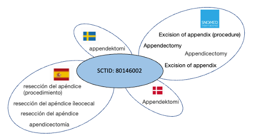

# 3.1-add-terms-in-languages-and-dialects

## Add Terms in Languages and Dialects

## Overview

Representing language, dialect or specialty-specific term preferences is possible using a SNOMED CT extension. The logical design of SNOMED CT enables a single clinical idea to be associated with a range of terms or phrases from various languages, as depicted in Figure 3.1-1. In an extension, terms relevant for a particular country, speciality, hospital (or other organization) may be created, and different options for term preferences may be specified. Even within the same country, different regional dialects or specialty-specific languages exist may influence which synonyms are preferred. SNOMED CT supports this level of granularity for language preferences at the national or local level.

<figure><figcaption>
Figure 3.1-1: SNOMED CT allows a single clinical idea to be associated with a range of terms from various languages
</figcaption></figure>

Examples of situations in which additional terms may be required together with the type of organisation that may be involved in producing these terms.

| **What**                                                                          | **Responsible**                                             |
| --------------------------------------------------------------------------------- | ----------------------------------------------------------- |
| A translation of SNOMED CT into the language (-s) of the Member country/territory | National Release Center                                     |
| Creation of patient-friendly terms                                                | National Release Center, hospital or department, speciality |
| Creation of local synonyms                                                        | Vendor, hospital or department                              |


Information on translating SNOMED CT can be found via the SNOMED International website, see [https://www.snomed.org/use-snomed-ct](https://www.snomed.org/use-snomed-ct).


## Key Steps

In section [5 Key Steps](<../5 key-steps/>) we explain the full set of steps for producing any extension. However, not all of these steps are required for all purposes. If producing an extension for the purpose of adding terms in languages and dialects, the following key steps are of particular relevance:

* **Create descriptions**
  * Principle and process for creating descriptions: [Add Description in an Extension](<../5 key-steps/5.4 authoring/5.4.3 authoring-descriptions/5.4.3.1-add-description-in-an-extension.md>)
* **Specify the acceptability of the created descriptions in a language reference set**
  * Introduction to language reference set: [Language Reference Set](<../4 logical-design/4.3 extensions/4.3.2 reference-sets/4.3.2.4 essential-reference-sets/4.3.2.4.1-language-reference-set.md>)
  * Principle and process for creating language reference set: [Create a New Reference Set](https://app.gitbook.com/s/qOI2v58ZsXOoklmwBOk4/6-reference-set-development)
  * Principle and process for creating the individual reference set members: [Add Members to a Reference Set](https://app.gitbook.com/s/qOI2v58ZsXOoklmwBOk4/6-reference-set-development/6.3-development/6.3.3-authoring-reference-set-members/6.3.3.1-add-members-to-a-reference-set)
