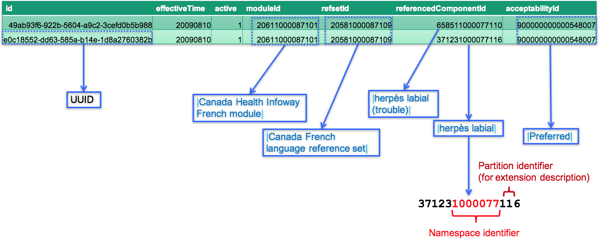

# 4.3.2.4.1 Language Reference Set

Whenever a new description is added in an extension, the language preferences associated with that description must be specified. This is done by adding rows to a [language reference set](https://confluence.ihtsdotools.org/display/DOCRELFMT/5.2.2.1+Language+Reference+Set) to indicate whether each description is [ | acceptable|](http://snomed.info/id/900000000000549004 "900000000000549004 | acceptable |") or [ | preferred|](http://snomed.info/id/900000000000548007 "900000000000548007 | preferred |") in the given language or dialect.

# Attributes

As previously mentioned, all reference sets use six [common attributes](4 Logical Design/4.3.2.1-.1.md). In addition to these, a [ | Language type reference set|](http://snomed.info/id/900000000000506000 "900000000000506000 | Language type reference set |") also includes an **acceptabilityId**. The table below explains how each of these attributes is populated in a [ | Language type reference set|](http://snomed.info/id/900000000000506000 "900000000000506000 | Language type reference set |") . 

Table 4.3.2.4.1-1: Summary of language reference set attributes

Attribute| Data Type| Use in a Language Reference Set  
---|---|---  
id| UUID| Can be generated using a standard [UUID](https://confluence.ihtsdotools.org/display/DOCGLOSS/UUID "Glossary link: UUID") generator.  
effectiveTime| Time| Specifies the date on which this version of the reference set member was released.  
active| Boolean| Indicates whether or not the reference set member is active at the given effectiveTime. This value is set to "1" for new reference set members.  
moduleId| SCTID| Identifies the module to which this reference set member belongs. For members in an extension, this will always be a module created by the extension producer.  
refsetId| SCTID| This refers to the concept id of a descendant of [ | Language type reference set|](http://snomed.info/id/900000000000506000 "900000000000506000 | Language type reference set |") and represents the language or dialect for which the preferences are defined. The reference set concept may be created in the extension, or may belong to a module on which the extension depends (e.g. the international core module).  
referencedComponentId| SCTID| The referencedComponentId refers to the id of the description whose acceptability is being defined.  
acceptabilityId| SCTID| The acceptabilityId indicates whether the description referenced by the referencedComponentId is [ | Acceptable|](http://snomed.info/id/900000000000549004 "900000000000549004 | Acceptable |") or [ | Preferred|](http://snomed.info/id/900000000000548007 "900000000000548007 | Preferred |") for the given language or dialect.  
  
# Example

In [Figure 4.3.2.4.1-1](https://confluence.ihtsdotools.org/display/DOCEXTPG/4.3.2.4.1+Language+Reference+Set#Figure-canada-french-language-reference-set "Rows from the |Canada French language reference set") below, two rows from the [ 20581000087109 | Canada French language reference set|](http://snomed.info/id/20581000087109 "20581000087109 | Canada French language reference set |") are shown. Note that these rows specify French Canadian language preferences for the concept [ | Herpes labialis|](http://snomed.info/id/1475003 "1475003 | Herpes labialis |") .

  

Figure 4.3.2.4.1-1: Rows from the |Canada French language reference set

Please note the following:

  * The id column shows a UUID that has been uniquely generated for each refset member.
  * The moduleId indicates that these refset members belong to the [ | Canada Health Infoway French module|](http://snomed.info/id/20611000087101 "20611000087101 | Canada Health Infoway French module |") .
  * The refsetId indicates that both members are part of the [ | Canada French language reference set|](http://snomed.info/id/20581000087109 "20581000087109 | Canada French language reference set |") .
  * The referencedComponentId indicates the description for which the acceptability is being specified.
  * The acceptabilityId indicates that both of these descriptions are [ | Preferred|](http://snomed.info/id/900000000000548007 "900000000000548007 | Preferred |") in this language.

