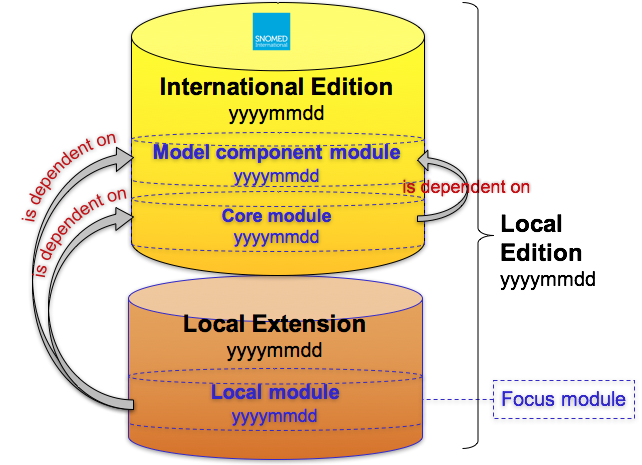
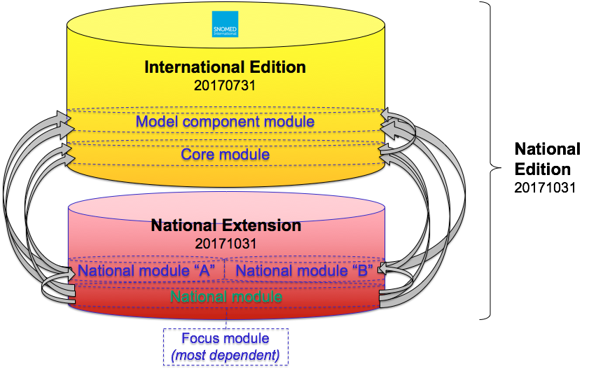

# 4.4 Editions

A SNOMED CT edition is a complete set of SNOMED CT components and reference set members that belong to an identified focus module plus all of the modules on which the focus module depends. Every SNOMED CT edition includes the contents of zero or more extension modules and the contents of the International Edition. The International Edition itself includes the contents of the [ | SNOMED CT core module|](http://snomed.info/id/900000000000207008 "900000000000207008 | SNOMED CT core module |") and the [ | SNOMED CT model component module|](http://snomed.info/id/900000000000012004 "900000000000012004 | SNOMED CT model component module |") .

An edition consists of a set of modules (usually maintained by different organizations) that can be used as a standalone terminology solution within a healthcare environment. For this reason, many extension producers choose to publish their extension as an edition (which includes the content on which the extension depends), rather than as a separate extension. As explained in [5.6.1.2 Packaging and File Naming](5.6.1.2-.2.md), however, use cases exist for both packaging options.

[Figure 4.4-1](https://confluence.ihtsdotools.org/display/DOCEXTPG/4.4+Editions#Figure-generic-edition "The composition of an edition is based on its module dependencies") below illustrates the composition and dependencies of a local edition that is composed of a local extension module and the two international modules.

Figure 4.4-1: The composition of an edition is based on its module dependencies

The local edition consists of all components and reference set members that belong to the focus module and the two modules on which the focus module depends - [ | SNOMED CT core module|](http://snomed.info/id/900000000000207008 "900000000000207008 | SNOMED CT core module |") and the [ | SNOMED CT model component module|](http://snomed.info/id/900000000000012004 "900000000000012004 | SNOMED CT model component module |") . As discussed previously, the version specific dependencies must be stated in the [Module Dependency Reference Set](4 Logical Design/4.3.2.4.2-.2.md).

# Versioned Edition 

There are many use cases that require a date specific version of an edition, including specifying the [substrate](https://confluence.ihtsdotools.org/display/DOCANLYT/3.3+Substrates+for+Analytics) of a SNOMED CT query, and specifying the version of SNOMED CT used to code a specific data element in a health record. A [versioned edition](https://confluence.ihtsdotools.org/display/DOCGLOSS/versioned+edition "Glossary link: versioned edition") includes the contents of the specified version of the focus module, plus the contents of all [versioned modules](https://confluence.ihtsdotools.org/display/DOCGLOSS/versioned+module "Glossary link: versioned modules") on which the versioned focus module depends (as specified in the [ | Module dependency reference set|](http://snomed.info/id/900000000000534007 "900000000000534007 | Module dependency reference set |") ). The version of an edition is based on the date on which the edition was released. Many extension providers release their extensions as a versioned edition, using regular and predictable release cycles. For example, the International Edition is released by SNOMED International monthly.

Versioned editions can be identified using the [SNOMED CT URI Standard](https://confluence.ihtsdotools.org/display/DOCURI/URI+Standard) using the following format:

http://snomed.info/sct/{sctid}/version/{timestamp}

where {sctid} represents the id of edition's focus module, and {timestamp} represents the release date of the edition. For more information, please refer to [2.1 URIs for Editions and Versions](https://confluence.ihtsdotools.org/display/WIPURI/2.1+URIs+for+Editions+and+Versions).

The table below shows some examples of versioned editions of SNOMED CT, with their corresponding focus module, URI and set of included modules. 

Table 4.4-1: URIs for versioned editions of SNOMED CT

Edition| Focus module| URI| Included modules  
---|---|---|---  
International Edition, 20170731|  [ | SNOMED CT core module|](http://snomed.info/id/900000000000207008 "900000000000207008 | SNOMED CT core module |") | <http://snomed.info/sct/900000000000207008/version/20170731>| Metadata + Core  
International Edition, 20170731  
(with ICD-10 maps)|  [ | SNOMED CT to ICD-10 rule-based mapping module|](http://snomed.info/id/449080006 "449080006 | SNOMED CT to ICD-10 rule-based mapping module |") | <http://snomed.info/sct/449080006/version/20170731>| Metadata + Core + ICD-10 maps  
US Edition, 20170901|  [ | US National Library of Medicine maintained module|](http://snomed.info/id/731000124108 "731000124108 | US National Library of Medicine maintained module |") | <http://snomed.info/sct/731000124108/version/20170901>| Metadata + Core + NLM maintained module  
US Edition, 20170901(with ICD-10-CM maps)|  [ | SNOMED CT to ICD-10-CM rule-based mapping module|](http://snomed.info/id/5991000124107 "5991000124107 | SNOMED CT to ICD-10-CM rule-based mapping module |") | <http://snomed.info/sct/5991000124107/version/20170901>| Metadata + Core + NLM maintained module + ICD-10-CM maps  
  
Please note that a versioned edition is a logical composition of modules, and does not necessarily correspond to a single release package. For more information on release packages, please refer to [4.5 Release Packages](4 Logical Design/4.5-.5.md) and [5.6.1.2 Packaging and File Naming](5.6.1.2-.2.md).

# Focus Module

As discussed above, an edition is defined based on a single focus module. This focus module must be the most dependent module, in that the focus module is dependent on all the other modules in the edition. Note that the [ | SNOMED CT model component module|](http://snomed.info/id/900000000000012004 "900000000000012004 | SNOMED CT model component module |") is always the least dependent module in all SNOMED CT editions, as it has no dependencies to other modules.

If a situation arises in which an extension has two equally dependent modules, then a new focus module may need to be created, with dependencies defined to all other modules in the edition. In this case, the focus module may contain only the components used to define the module concept itself and its dependencies as defined in the module dependency reference set. [Figure 4.4-2](https://confluence.ihtsdotools.org/display/DOCEXTPG/4.4+Editions#Figure-most-dependent-module "Creating a new focus module to represent a national edition") below illustrates a situation in which two (equally dependent) sibling modules exist - national module A and national module B - which are both dependent on the [ | SNOMED CT core module|](http://snomed.info/id/900000000000207008 "900000000000207008 | SNOMED CT core module |") and the [ | SNOMED CT model component module|](http://snomed.info/id/900000000000012004 "900000000000012004 | SNOMED CT model component module |") , and are not dependent on each other. To form a national edition, which contains both national module A and national module B, a new focus module must be created that is dependent on all other modules in the edition. The concept id of the new focus module is then used in the URI of the national edition that contains both national module A and national module B.

Figure 4.4-2: Creating a new focus module to represent a national edition
