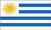
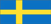
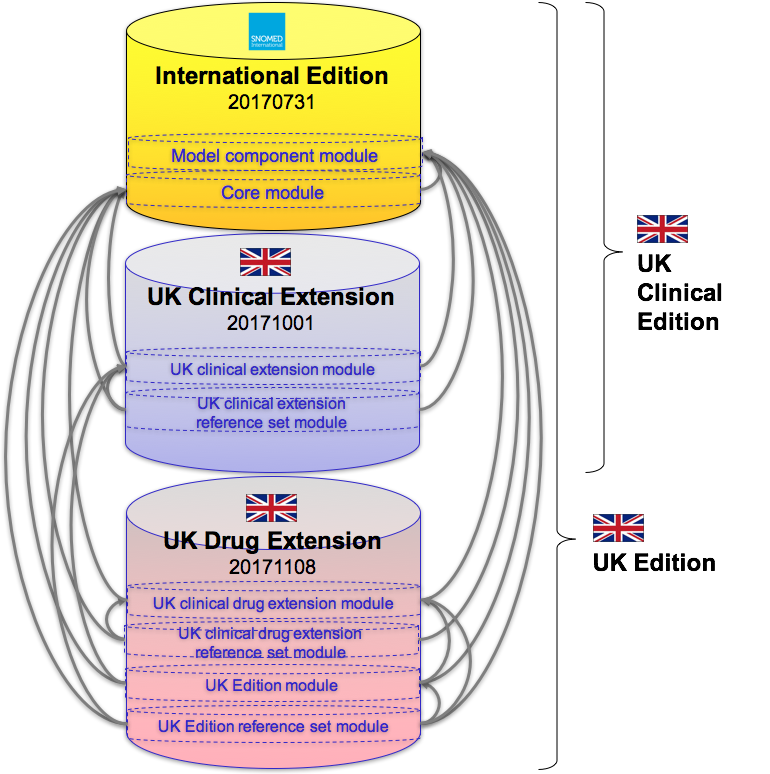

# 4.4.1 National Editions

National editions are published by a number of SNOMED International Members to customize the SNOMED CT International Edition to a specific country or territory.  [Table 4.4.1-1](https://confluence.ihtsdotools.org/display/DOCEXTPG/4.4.1+National+Editions#Table-national-editions-of-snomed-ct "Examples of national SNOMED CT editions") lists some examples of Members who have published national editions of SNOMED CT. Please note that the International Edition is translated into Spanish. However, this translation is performed by SNOMED International, and is therefore not distributed as a national edition. 

Table 4.4.1-1: Examples of national SNOMED CT editions

| Australian edition| | Netherlands edition| | Canadian edition| | UK edition  
---|---|---|---|---|---|---|---  

| Danish edition| | Uruguay edition| | US edition| | Swedish edition  
  
[Table 4.4.1-2](https://confluence.ihtsdotools.org/display/DOCEXTPG/4.4.1+National+Editions#Table-editions-of-snomed-ct-and-their-included-content "Examples of national editions with their included modules") lists some examples of published SNOMED CT editions and their included modules, as specified in the [Module Dependency Reference Set](4 Logical Design/4.3.2.4.2-.2.md). Please note that a number of Members publish more than one edition. For example, in the UK both a national edition and clinical edition are published. 

Table 4.4.1-2: Examples of national editions with their included modules

  
| Edition| Included modules  
---|---|---  

| International Edition, 20170731|  [ | SNOMED CT model component module|](http://snomed.info/id/900000000000012004 "900000000000012004 | SNOMED CT model component module |") \+ [ | SNOMED CT core module|](http://snomed.info/id/900000000000207008 "900000000000207008 | SNOMED CT core module |") [1](https://confluence.ihtsdotools.org/display/DOCEXTPG/4.4.1+National+Editions#Footnote1 "Footnote: Click here to display the footnote")  

| United States Edition, 20170901| SNOMED CT International Edition: [ | SNOMED CT model component module|](http://snomed.info/id/900000000000012004 "900000000000012004 | SNOMED CT model component module |") \+  [ | SNOMED CT core module|](http://snomed.info/id/900000000000207008 "900000000000207008 | SNOMED CT core module |")  
\+ US Extension: [ | US National Library of Medicine maintained module|](http://snomed.info/id/731000124108 "731000124108 | US National Library of Medicine maintained module |") \+ [ | SNOMED CT to ICD-10-CM rule-based mapping module|](http://snomed.info/id/5991000124107 "5991000124107 | SNOMED CT to ICD-10-CM rule-based mapping module |")  

| Canadian Edition, 20171031| SNOMED CT International Edition: [ | SNOMED CT model component module|](http://snomed.info/id/900000000000012004 "900000000000012004 | SNOMED CT model component module |") \+ [ | SNOMED CT core module|](http://snomed.info/id/900000000000207008 "900000000000207008 | SNOMED CT core module |")  
\+ Canadian Extension: [ | Canada Health Infoway English module|](http://snomed.info/id/20621000087109 "20621000087109 | Canada Health Infoway English module |") \+ [ | Canada Health Infoway Reference Set Module|](http://snomed.info/id/22091000087100 "22091000087100 | Canada Health Infoway Reference Set Module |") \+ [ | Canada Health Infoway French module|](http://snomed.info/id/20611000087101 "20611000087101 | Canada Health Infoway French module |")  

| United Kingdom Clinical Edition, 20171001[2](https://confluence.ihtsdotools.org/display/DOCEXTPG/4.4.1+National+Editions#Footnote2 "Footnote: Click here to display the footnote") | SNOMED CT International Edition: [ | SNOMED CT model component module|](http://snomed.info/id/900000000000012004 "900000000000012004 | SNOMED CT model component module |") \+ [ | SNOMED CT core module|](http://snomed.info/id/900000000000207008 "900000000000207008 | SNOMED CT core module |")  
\+ UK SNOMED CT Clinical Extension: [ | SNOMED CT United Kingdom clinical extension module|](http://snomed.info/id/999000011000000103 "999000011000000103 | SNOMED CT United Kingdom clinical extension module |") \+ [ | SNOMED CT United Kingdom clinical extension reference set module|](http://snomed.info/id/999000021000000109 "999000021000000109 | SNOMED CT United Kingdom clinical extension reference set module |")  

| United Kingdom Edition, 20171108| SNOMED CT International Edition: [ | SNOMED CT model component module|](http://snomed.info/id/900000000000012004 "900000000000012004 | SNOMED CT model component module |") \+ [ | SNOMED CT core module|](http://snomed.info/id/900000000000207008 "900000000000207008 | SNOMED CT core module |")  
\+ UK SNOMED CT Clinical Extension: [ | SNOMED CT United Kingdom clinical extension module|](http://snomed.info/id/999000011000000103 "999000011000000103 | SNOMED CT United Kingdom clinical extension module |") \+ [ | SNOMED CT United Kingdom clinical extension reference set module|](http://snomed.info/id/999000021000000109 "999000021000000109 | SNOMED CT United Kingdom clinical extension reference set module |")  
\+ UK SNOMED CT Drug Extension: [ | SNOMED CT United Kingdom drug extension module|](http://snomed.info/id/999000011000001104 "999000011000001104 | SNOMED CT United Kingdom drug extension module |") \+ [ | SNOMED CT United Kingdom drug extension reference set module|](http://snomed.info/id/999000021000001108 "999000021000001108 | SNOMED CT United Kingdom drug extension reference set module |") \+ [ | SNOMED CT United Kingdom Edition module|](http://snomed.info/id/999000041000000102 "999000041000000102 | SNOMED CT United Kingdom Edition module |") \+ [ | SNOMED CT United Kingdom Edition reference set module|](http://snomed.info/id/999000031000000106 "999000031000000106 | SNOMED CT United Kingdom Edition reference set module |")  
  
# US Edition

[Figure 4.4.1-1](https://confluence.ihtsdotools.org/display/DOCEXTPG/4.4.1+National+Editions#Figure-depiction-of-us-edition "The modules in the US edition") shows the four modules contained in the 20170901 US Edition, together with their module dependencies. Two of the modules are from the 20170901 US Extension, and the other two are from the 20170731 International Edition. Please note that the module dependencies (shown as grey arrows) are date specific, so each versioned source module is dependent on a versioned target module. The module names in this diagram have been shortened for brevity.

  

Figure 4.4.1-1: The modules in the US edition

[Table 4.4.1-3](https://confluence.ihtsdotools.org/display/DOCEXTPG/4.4.1+National+Editions#Table-us-edition-uri "US Edition focus module and URI") lists the focus module and URI for the 20170901 US Edition. 

Table 4.4.1-3: US Edition focus module and URI

Edition| Focus module| URI  
---|---|---  
US Edition, 20170901|  [ | SNOMED CT to ICD-10-CM rule-based mapping module|](http://snomed.info/id/5991000124107 "5991000124107 | SNOMED CT to ICD-10-CM rule-based mapping module |") | <http://snomed.info/sct/5991000124107/version/20170901>  
  
# Australian Edition

[Figure 4.4.1-2](https://confluence.ihtsdotools.org/display/DOCEXTPG/4.4.1+National+Editions#Figure-depiction-of-australian-edition "The modules in the Australian Edition") shows the five main modules in the 20171130 Australian Edition, together with their module dependencies. Two of the modules are from the 20170731 International Edition, and three are from the 20171130 Australian extension. 

Figure 4.4.1-2: The modules in the Australian Edition

[Table 4.4.1-4](https://confluence.ihtsdotools.org/display/DOCEXTPG/4.4.1+National+Editions#Table-australian-edition-table "Australian Edition focus module and URI") lists the focus module and URI for the 20171130 Australian Edition. 

Table 4.4.1-4: Australian Edition focus module and URI

Edition| Focus module| URI  
---|---|---  
Australian Edition, 20171130|  [ | SNOMED Clinical Terms Australian extension|](http://snomed.info/id/32506021000036107 "32506021000036107 | SNOMED Clinical Terms Australian extension |") | _<http://snomed.info/sct/32506021000036107/version/20171130>_  
  
# United Kingdom Editions

[Figure 4.4.1-3](https://confluence.ihtsdotools.org/display/DOCEXTPG/4.4.1+National+Editions#Figure-depiction-of-uk-edition "The modules of the two UK editions") shows the eight modules contained in either the 20171001 UK Clinical Edition or the 20171108 UK Edition, together with their dependencies. The 20171001 UK Clinical Edition contains 4 modules, including two from the International Edition and two from the UK Clinical Extension. The 20171108 UK Edition contains eight modules, including two from the International Edition, two from the UK Clinical Extension and four from the UK Drug Extension. 

  

Figure 4.4.1-3: The modules of the two UK editions

[Table 4.4.1-5](https://confluence.ihtsdotools.org/display/DOCEXTPG/4.4.1+National+Editions#Table-uk-editions-table "UK Edition focus modules and URIs") lists the focus modules and URIs for the 20171001 UK Clinical Edition and 20171108 UK Edition. 

Table 4.4.1-5: UK Edition focus modules and URIs

Edition| Focus module| URI  
---|---|---  
UK Clinical Edition, 20171001|  [ | SNOMED CT United Kingdom clinical extension reference set module|](http://snomed.info/id/999000021000000109 "999000021000000109 | SNOMED CT United Kingdom clinical extension reference set module |") | _<http://snomed.info/sct/999000021000000109/version/20171001>_  
UK Edition, 20171108|  [ | SNOMED CT United Kingdom Edition reference set module|](http://snomed.info/id/999000031000000106 "999000031000000106 | SNOMED CT United Kingdom Edition reference set module |") | _<http://snomed.info/sct/999000031000000106/version/20171108>_  
  
Footnotes Ref | Notes  
---|---  
[1](https://confluence.ihtsdotools.org/display/DOCEXTPG/4.4.1+National+Editions#FootnoteMarker1-0 "Footnote: Click to return to reference in text") |  Note that although the [ | SNOMED CT to ICD-10 rule-based mapping module|](http://snomed.info/id/449080006 "449080006 | SNOMED CT to ICD-10 rule-based mapping module |") is included in the International Edition release package, it is not considered part of the formal International Edition and extensions are not required to reference this module.   
[2](https://confluence.ihtsdotools.org/display/DOCEXTPG/4.4.1+National+Editions#FootnoteMarker2-0 "Footnote: Click to return to reference in text") |  Note that the UK Clinical Edition contains the International Release and the UK SNOMED CT Clinical Extension of SNOMED CT only (not the UK Drug Extension). <https://isd.digital.nhs.uk/trud3/user/guest/group/0/pack/26>
