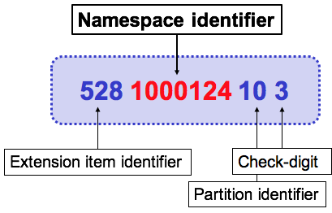

# Namespaces

The design of SNOMED CT specifies that all components (concepts, descriptions and relationships) are identified using SCTIDs. This is true for both components in the International Edition, and components in an extension. Extension producers therefore need a mechanism to ensure that their component identifiers are globally unique, and do not collide with the SCTIDs generated by other organizations. The SNOMED CT namespace identifier provides this mechanism. The namespace identifier ensures that all components within an extension are properly and uniquely identified, both locally and globally.

Prior to creating an extension, each organization must obtain a unique namespace identifier from SNOMED International (see [https://www.snomed.org/change-or-add](https://www.snomed.org/change-or-add)). Once the namespace identifier is issued, SNOMED International authorizes the allocated organization to generate SCTIDs within their allocated namespace to identify extension components. Each SNOMED CT namespace identifier is 7 digits in length. By including this 7 digit identifier in the appropriate position within an SCTID, and maintaining locally unique item identifiers, global uniqueness of SCTIDs can be ensured.

## Examples

The table below lists some examples of namespace identifiers and the organizations to which they are allocated. These organizations include National Release Centers (or NRCs), local organizations, and commercial vendors. Note that this table is an excerpt from the SNOMED CT [Namespace Registry](https://docs.google.com/spreadsheets/d/1qbCiwCcsW3O9MOsNw2oUbSO_BjNhm0VNq5NEiMqxMf4/edit?usp=sharing) as of October, 2017.

Table: Examples of namespace identifiers

<table><thead><tr><th width="142.54296875">Namespace ID</th><th>Organization</th></tr></thead><tbody><tr><td>1000124</td><td>National Library of Medicine (USA) – IHTSDO Member</td></tr><tr><td>1000087</td><td>Canada Health Infoway (Canada) – IHTSDO Member</td></tr><tr><td>1000052</td><td>National Board of Health and Welfare (Sweden) – IHTSDO Member</td></tr><tr><td>1000119</td><td>Kaiser Permanente</td></tr><tr><td>1000129</td><td>B2i International LLC</td></tr></tbody></table>

The image below illustrates the structure of an extension SCTID using the concept [5281000124103 | Persistent asthma|](http://snomed.info/id/5281000124103) from the 20170301 US Edition of SNOMED CT. The structure of the SCTID has been labeled and the namespace identifier is shown in red. Note that the spaces do not form part of the SCTID and have been added to improve readability.

<figure><figcaption>
The structure of an example extension SCTID
</figcaption></figure>

<a href="https://docs.google.com/forms/d/e/1FAIpQLScTmbZIf0UEQwYDkY27EEWBkaiYkHSbR0_9DmFrMLXoQLyL7Q/viewform?usp=pp_url&#x26;entry.1767247133=Extension+Guide&#x26;entry.670899847=Namespaces" class="button primary">Provide Feedback</a>
