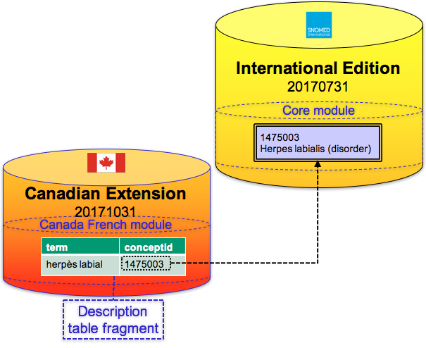
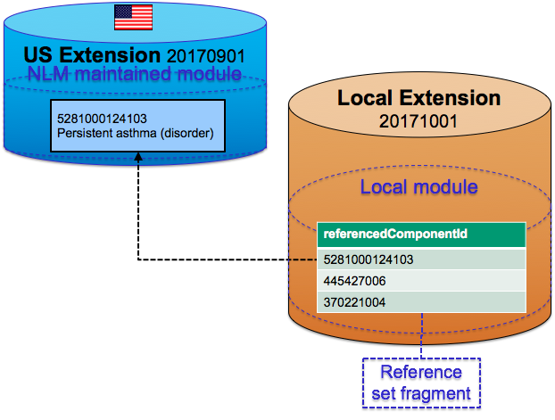
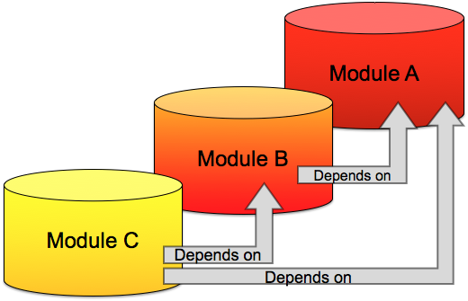

# Module Dependencies

## Module Dependencies

## Overview

Content in one module may refer to content in another module. For example, a concept in an extension module may by the source of an [| is a|](http://snomed.info/id/116680003) relationship, whose destination is a concept in the international core module. Content dependencies may include:

* Extension concepts with an [| Is a|](http://snomed.info/id/116680003) relationship whose destination is in another module
* Extension concepts with a defining attribute relationship whose destination is in another module
* Extension concepts with a defining relationship whose type belongs to another module
* Extension descriptions which are associated with a concept from another module
* Extension reference set members that reference components from another module
* Extension components with properties (e.g. definitionStatusId) that belong to the international [| SNOMED CT model component module|](http://snomed.info/id/900000000000012004)

The image below illustrates a local extension module that references content in a national extension, and is therefore dependent on the national extension module; and similarly a national extension module that references content in the International Edition, and is therefore dependent on the international modules.

<figure><figcaption>
A dependent module references content in the module it depends on
</figcaption></figure>

In this situation, we refer to the local extension as being a 'child' of the national extension 'parent', because the local extension contains a module that is dependent on a module in the national extension. Similarly, the national extension is a 'child' of the International Edition 'parent', because the national extension contains a module that is dependent on a module from the International Edition.

## Examples

The practical examples below demonstrate how content within a module can rely on another module, either directly or indirectly. As these examples also reference the logical design, the applicable SNOMED CT attributes have been **bolded**. For more detailed information on these attributes please refer to the [SNOMED CT Release File Specifications](https://confluence.ihtsdotools.org/display/DOCRELFMT/SNOMED+CT+Release+File+Specifications).

### Translation of Concepts

An extension, which includes translations of concepts from the International Edition, will include extension descriptions whose **conceptId** belongs to the International Edition. Therefore the content in this extension module directly relies on content in a module from the International Edition. As shown in the image below, this content dependency results in a module dependency.

<figure><figcaption>
Figure 4.2.2-2: A content dependency caused by a translation
</figcaption></figure>

### Defining Subsets of Concepts

In this example, a local extension contains a simple reference set that represents a subset of concepts. If one or more of the concepts in this subset belong to the National Extension, the extension reference set will contain rows in which the **referencedComponentId** refers to concepts from a module in the national extension. In this way, content from the local extension module relies on a module from the National Extension. The image below illustrates another example in which a content dependency results in a module dependency.

<figure><figcaption>
A content dependency caused by a reference set member
</figcaption></figure>

### Adding Concepts

In this example, the extension includes new clinical content. Because all active concepts in an extension must be subsumed by the root concept, [|SNOMED CT Concept|](http://snomed.info/id/138875005), there must exist at least one [| is a|](http://snomed.info/id/116680003) relationship in the extension with a **destinationId** that refers to a concept in another module. Clinical content in the extension module must depend on the international core module either directly or indirectly. The image below illustrates another example in which a content dependency results in a module dependency.

<figure><figcaption></figcaption></figure>

## Module Dependency Reference Set

The content dependencies described above create a need to establish a formal link between the dependent module and the modules on which it depends. These dependencies are defined in SNOMED CT at the module level, rather than being defined based on an entire extension. This allows extensions to be subdivided into separate modules, with different dependencies on modules in the same extension, in other extensions, or in the International Edition.

It is important to note that module dependencies are _version_ specific. This means that each module dependency specifies the specific version of the source (child) module that is dependent on a specific version of the target (parent) module. This approach is important as new versions of either the source or target modules may affect the required dependencies.

| A module is dependent on another module if it contains references to any component in another module. |
| ----------------------------------------------------------------------------------------------------- |

| A module may only contain references to SCTIDs which exist within the module itself, or in any module it depends on. |
| -------------------------------------------------------------------------------------------------------------------- |

The extension producer is responsible for specifying the module dependencies for every version of each extension module. Module dependencies are specified by adding rows in the [| Module dependency reference set|](http://snomed.info/id/900000000000534007) . For more information on this reference set format, please refer to the Module Dependency Reference Set.

It is important to note that all dependencies for each module (including transitive dependencies) must be explicitly stated. For example, the image below illustrates an example in which all 3 dependencies must be explicitly stated: Module C is dependent on Module B, Module B is dependent on Module A and Module C is dependent on Module A.

<figure><figcaption>
Explicitly stating transitive module dependencies
</figcaption></figure>
