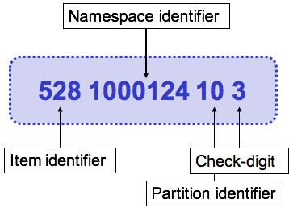

# Common Attributes

## Common Attributes

All components in an extension are represented using the same logical design as the International Edition. Concepts, descriptions and relationships all share four common attributes:

* id
* effectiveTime
* active
* moduleId

The following subsections explain how these attributes are used in an extension.

## **Id**

The first attribute of every extension component is **'id** '. The id uniquely identifies the component across all extensions globally. It is therefore important that extension identifiers are structured according to agreed rules. The image below shows the four parts of an extension SNOMED CT identifier (SCTID) - item identifier, namespace identifier, partition identifier and check digit.

<figure><figcaption>
The four parts of an extension SCTID
</figcaption></figure>

The table below explains the rules related to each of the four parts of a SNOMED CT identifier in an extension.

**Table: Rules for each part of an extension SCTID**

<table><thead><tr><th width="92.73828125" valign="top">Order</th><th valign="top">Part</th><th width="152.9765625" valign="top">Rules</th><th valign="top">Example</th></tr></thead><tbody><tr><td valign="top">1</td><td valign="top">Item identifier</td><td valign="top">

<ul><li>1 to 8 digits in length</li><li>Allocated by the extension producer</li><li>Must be unique for the given namespace identifier and component type</li></ul></td><td valign="top">528</td></tr><tr><td valign="top">2</td><td valign="top"><a href="https://confluence.ihtsdotools.org/display/WIPEXTPG/Namespaces">namespace identifier</a></td><td valign="top">

<ul><li>7 digits in length</li><li>Allocated by SNOMED International to the extension producer</li><li>Not used in components created by SNOMED International</li></ul></td><td valign="top">1000124</td></tr><tr><td valign="top">3</td><td valign="top"><a href="https://confluence.ihtsdotools.org/display/WIPGLOSS/Partition-identifier">partition identifier</a></td><td valign="top">

<ul><li>2 digits in length</li><li>
The following partition identifiers are used in an extension:
<ul><li>10 - extension concepts</li><li>11 - extension descriptions</li><li>12 - extension relationships</li></ul></li></ul></td><td valign="top">10</td></tr><tr><td valign="top">4</td><td valign="top"><a href="https://confluence.ihtsdotools.org/display/WIPGLOSS/check-digit">check digit</a></td><td valign="top">

<ul><li>1 digit in length</li><li>Computed from other digits in the SCTID using the <a href="http://snomed.org/verhoeff">Verhoeff check</a> algorithm</li></ul></td><td valign="top">3</td></tr></tbody></table>

## effectiveTime

The second attribute of every extension component is **'effectiveTime**'. This attribute specifies the date on which the specific version of the component was released, using the ISO 8601 YYYYMMDD format. When a component is added or modified in an extension, the effectiveTime of the component version will match the version date of the release.

## active

The third attribute of every extension component is '**active** '. This attribute specifies whether or not the specific version of the component is active at the given effectiveTime. The data type of this attribute is Boolean, with a value of "1" indicating that the component is active at the given effectiveTime and a value of "0" indicating that the component is inactive at the given effectiveTime. New components in an extension will use an active value of "1".

## moduleId

The fourth attribute in every extension component is '**moduleId** '. This attribute specifies the module in which the component is being maintained at the given effective time. The value of this attribute is the SCTID of a module concept that is created and maintained by the extension producer. Please refer to [Module Definition](<../../4.2 modules/4.2.1-module-definition.md>) for more information on this topic.
