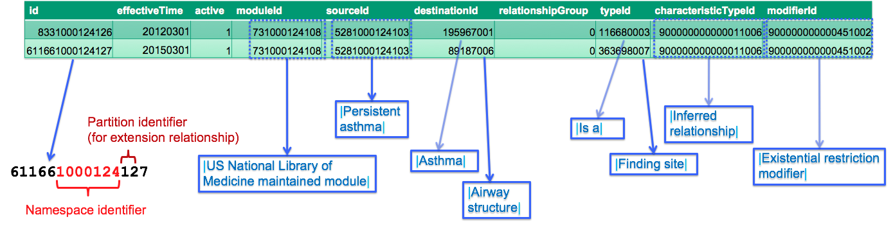

# 4.3.1.4 Relationships

# Overview

Relationships are added in an extension to link a new concept to one of its supertypes, or to specify defining attribute relationships. Note that at least one hierarchical ( [ | Is a|](http://snomed.info/id/116680003 "116680003 | Is a |") ) relationship is required for each new extension concept. Extension relationships are distributed in a [relationship file](https://confluence.ihtsdotools.org/display/DOCRELFMT/3.2.3.+Relationship+File+Specification), which follows the standard [RF2 release file format](http://snomed.org/rfs). For more details on the principles and processes for authoring relationships in an extension, please refer to [5.4.4 Authoring Relationships](5.4.4-Authoring-Relationships_57815272.html).

# Attributes

In addition to the four [common attributes](4.3.1.2-Concepts_57815092.html#id-4.3.1.2Concepts-CommonAttributes), relationships also have a sourceId, destinationId, relationshipGroup, typeId, characteristicTypeId and modifierId.

## sourceId

The sourceId identifies the concept being defined by the relationship. In the case of a hierarchical ( [ | Is a|](http://snomed.info/id/116680003 "116680003 | Is a |") ) relationship, the sourceId refers to the subtype/child concept.

## destinationId

The destinationId represents the value of the defining relationship. In the case of a hierarchical ( [ | Is a|](http://snomed.info/id/116680003 "116680003 | Is a |") ) relationship, the destinationId refers to the supertype/parent concept. The destinationId may refer to a concept in the same extension module as the source concept, or any module on which this extension module depends.

## relationshipGroup

The relationshipGroup is an integer that indicates whether or not the relationship is grouped together with other relationships associated with the same source concept. Any relationships with the same sourceId and relationshipGroup integer (other than zero) are considered to belong to the same relationship group. A relationshipGroup of zero (i.e. "0") indicates that the relationship was not grouped with other relationships by the terminology author. For more information on relationship groups, please refer to Relationship groups in SNOMED CT.

## typeId

The typeId is a SCTID that specifies the attribute type of the relationship. In the case of a hierarchical relationship, the value of this attribute is [ | Is a|](http://snomed.info/id/116680003 "116680003 | Is a |") . Attribute relationships use a typeId value that refers to a subtype of [ | Concept model attribute|](http://snomed.info/id/410662002 "410662002 | Concept model attribute |") . Common examples of attribute types include [ | Finding site|](http://snomed.info/id/363698007 "363698007 | Finding site |") and [ | Method|](http://snomed.info/id/260686004 "260686004 | Method |") .

In most cases, the typeId will refer to an international concept. However, additional attribute concepts may be added in an extension if there is a legitimate clinical need, and clear rules and guidance is provided. For more information, please refer to [5.4.4.1 Add Relationship in an Extension](5.4.4.1-Add-Relationship-in-an-Extension_57815279.html).

## characteristicTypeId

The characteristicTypeId is a SCTID, which specifies whether this relationship was stated by an author or was inferred by a description logic classifier. For more information, please refer to [5.6.1.1 Classifying an Edition](5.6.1.1-Classifying-an-Edition_57815328.html).

## modifierId

The modifierId attribute is a SCTID which specifies the type of description logic that applies to the given relationship - existential restriction (i.e. 'there exists some') or universal restriction (i.e. 'there exists only'). All relationships in the International Edition use the value [ | Existential restriction modifier|](http://snomed.info/id/900000000000451002 "900000000000451002 | Existential restriction modifier |") . This value is also recommended for extension relationships, as the value [ | Universal restriction modifier|](http://snomed.info/id/900000000000452009 "900000000000452009 | Universal restriction modifier |") can significantly affect the speed of classification.

# Example

In [Figure 4.3.1.4-1](https://confluence.ihtsdotools.org/display/DOCEXTPG/4.3.1.4+Relationships#Figure-adding-rows-to-the-relationships-table "Rows from the relationship table in the 20170901 US Edition") two rows from the relationship table of the 20170901 US edition are shown. Note that these relationships are used to define the extension concept from the earlier [example](https://confluence.ihtsdotools.org/display/WIPEXTPG/Concepts#Concepts-Conceptexample).

<figure><figcaption>
Figure 4.3.1.4-1: Rows from the relationship table in the 20170901 US Edition
</figcaption></figure>

Please note the following:

  * The relationship ids use a namespace identifier allocated to the National Library of Medicine (NLM). This indicates that these relationships were originally created by the NLM.
  * The relationship ids use a partition identifier of “12”. This indicates that the relationships were created in an extension.
  * The moduleId indicates that these relationships are included in the [ | US National Library of Medicine maintained module|](http://snomed.info/id/731000124108 "731000124108 | US National Library of Medicine maintained module |") . This is the same module as the source concept belongs to.
  * The sourceId indicates that the relationship defines the concept [ | Persistent asthma|](http://snomed.info/id/5281000124103 "5281000124103 | Persistent asthma |") .
  * The typeId indicates that the first relationship is an [ | Is a|](http://snomed.info/id/116680003 "116680003 | Is a |") relationship, while the second relationship specifies the [ | Finding site|](http://snomed.info/id/363698007 "363698007 | Finding site |") of the source concept.
  * The destinationId indicates that [ | Asthma|](http://snomed.info/id/195967001 "195967001 | Asthma |") is a supertype of [ | Is a|](http://snomed.info/id/116680003 "116680003 | Is a |") , and that the [ | Finding site|](http://snomed.info/id/363698007 "363698007 | Finding site |") of [ | Is a|](http://snomed.info/id/116680003 "116680003 | Is a |") is [ | Airway structure|](http://snomed.info/id/89187006 "89187006 | Airway structure |") .

<a href="https://docs.google.com/forms/d/e/1FAIpQLScTmbZIf0UEQwYDkY27EEWBkaiYkHSbR0_9DmFrMLXoQLyL7Q/viewform?usp=pp_url&entry.1767247133=Extension+Guide&entry.670899847=4.3.1.4%20Relationships" class="button primary">Provide Feedback</a>
