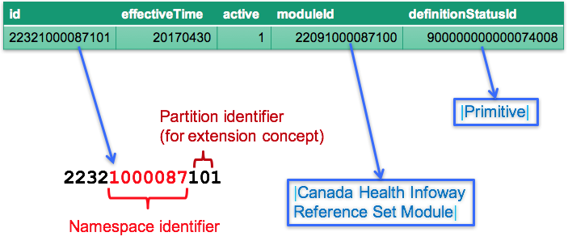
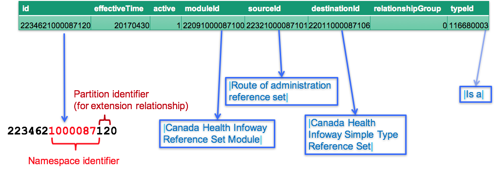
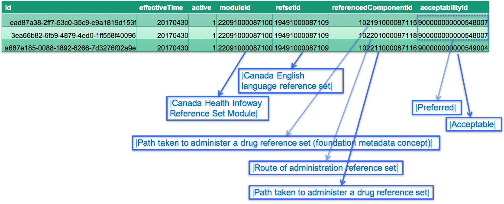

# 4.3.2.2 Reference Set Example

All reference sets require a concept to be created that represents the meaning of the reference set, provides the identification of the reference set, and names the reference set. These reference set concepts are created in the [ | Reference set (foundation metadata concept)|](http://snomed.info/id/900000000000455006 "900000000000455006 | Reference set \(foundation metadata concept\) |") subhierarchy as subtypes of a reference set concept that represents the associated reference set pattern. For more information about creating a reference set concept in an extension, please refer to [5.4.5.1 Create New Reference Set in an Extension](5.4.5.1-Create-New-Reference-Set-in-an-Extension_57815295.html).

In this section, we discuss an example reference set concept ( [ | Route of administration reference set|](http://snomed.info/id/22321000087101 "22321000087101 | Route of administration reference set |") ) from the 20170430 Canadian extension, and explain how this concept and its associated descriptions, relationships and language preferences are represented.

# Reference Set Concept

In [Figure 4.3.2.2-1](https://confluence.ihtsdotools.org/display/DOCEXTPG/4.3.2.2+Reference+Set+Example#Figure-adding-a-concept-to-identify-a-reference-set "Example reference set concept in the concept table") below, a row from the concept table is shown for the concept [ | Route of administration reference set|](http://snomed.info/id/22321000087101 "22321000087101 | Route of administration reference set |") .

<figure><figcaption>
Figure 4.3.2.2-1: Example reference set concept in the concept table
</figcaption></figure>

Please note the following:

  * The concept id uses a namespace identifier allocated to Canada Health Infoway.
  * The concept id uses a partition identifier of “10” to indicate that this concept was create in an extension.
  * The moduleId indicates that this concept belongs to the [ | Canada Health Infoway Reference Set Module|](http://snomed.info/id/22091000087100 "22091000087100 | Canada Health Infoway Reference Set Module |") .
  * The definitionStatusId indicates that this concept is [ | Primitive|](http://snomed.info/id/900000000000074008 "900000000000074008 | Primitive |") . Please note that all metadata concepts in SNOMED CT are [ | Primitive|](http://snomed.info/id/900000000000074008 "900000000000074008 | Primitive |") .

# Reference Set Description

In [Figure 4.3.2.2-2](https://confluence.ihtsdotools.org/display/DOCEXTPG/4.3.2.2+Reference+Set+Example#Figure-descriptions-associated-with-the-refset-identification-concept "Example descriptions for the reference set concept") below, a set of rows from the description table are shown. These descriptions provide terms that describe the concept [ | Route of administration reference set|](http://snomed.info/id/22321000087101 "22321000087101 | Route of administration reference set |") .

<figure><figcaption>
Figure 4.3.2.2-2: Example descriptions for the reference set concept
</figcaption></figure>

Please note the following:

  * The description id uses a namespace identifier allocated to Canada Health Infoway.
  * The description id uses a partition identifier of “11” to indicate that these descriptions were created in an extension.
  * The moduleId indicates that these descriptions belong to the [ | Canada Health Infoway Reference Set Module|](http://snomed.info/id/22091000087100 "22091000087100 | Canada Health Infoway Reference Set Module |") .
  * The conceptId links the descriptions to the reference set concept [ | Canada Health Infoway Reference Set Module|](http://snomed.info/id/22091000087100 "22091000087100 | Canada Health Infoway Reference Set Module |") .
  * A languageCode of "en" indicates that the terms are written in English.
  * The typeId indicates that the first description is a [ | Fully specified name|](http://snomed.info/id/900000000000003001 "900000000000003001 | Fully specified name |") , while the following two are of type [ | Synonym|](http://snomed.info/id/900000000000013009 "900000000000013009 | Synonym |") .
  * The term is used to name the associated reference set.
  * The caseSignificanceId indicates that the terms is [ | Only initial character case insensitive|](http://snomed.info/id/900000000000020002 "900000000000020002 | Only initial character case insensitive |") .

# Reference Set Relationship

In [Figure 4.3.2.2-3](https://confluence.ihtsdotools.org/display/DOCEXTPG/4.3.2.2+Reference+Set+Example#Figure-relationship-associated-with-the-refset-identification-concept "Example relationships for the reference set concept"), a row from the relationship table is shown. This relationship defines the supertype concept of [ | Route of administration reference set|](http://snomed.info/id/22321000087101 "22321000087101 | Route of administration reference set |") .

<figure><figcaption>
Figure 4.3.2.2-3: Example relationships for the reference set concept
</figcaption></figure>

Please note the following:

  * The relationship id uses a namespace identifier allocated to Canada Health Infoway.
  * The relationship id uses a partition identifier of “12” to indicate that this relationship was originally created in an extension.
  * The moduleId indicates that these relationships belong to the [ | Canada Health Infoway Reference Set Module|](http://snomed.info/id/22091000087100 "22091000087100 | Canada Health Infoway Reference Set Module |") .
  * The sourceId indicates that the relationship applies to the concept [ | Route of administration reference set|](http://snomed.info/id/22321000087101 "22321000087101 | Route of administration reference set |") .
  * The typeId indicates that the relationship represents an [ | Is a|](http://snomed.info/id/116680003 "116680003 | Is a |") relationship.
  * The destinationId indicates that [ | Canada Health Infoway Simple Type Reference Set|](http://snomed.info/id/22011000087106 "22011000087106 | Canada Health Infoway Simple Type Reference Set |") is a supertype of [ | Route of administration reference set|](http://snomed.info/id/22321000087101 "22321000087101 | Route of administration reference set |") .
  * The characteristicTypeId and modifierId columns have been omitted from this diagram for brevity.

# Reference Set Language preferences

In [Figure 4.3.2.2-4](https://confluence.ihtsdotools.org/display/DOCEXTPG/4.3.2.2+Reference+Set+Example#Figure-language-preferences-for-descriptions-associated-with-the-refset-identification-concept "Example language preferences for the reference set concept") below, a set of rows from the [ | Canada English language reference set|](http://snomed.info/id/19491000087109 "19491000087109 | Canada English language reference set |") are shown. These rows define the language preferences for the descriptions associated with the concept [ | Route of administration reference set|](http://snomed.info/id/22321000087101 "22321000087101 | Route of administration reference set |") .

<figure><figcaption>
Figure 4.3.2.2-4: Example language preferences for the reference set concept
</figcaption></figure>

Please note the following:

  * The id is a UUID that was generated for the corresponding refset member.
  * The moduleId indicates that these refset members belong to the [ | Canada Health Infoway Reference Set Module|](http://snomed.info/id/22091000087100 "22091000087100 | Canada Health Infoway Reference Set Module |") .
  * The refsetId column indicates that these rows are members of the [ | Canada English language reference set|](http://snomed.info/id/19491000087109 "19491000087109 | Canada English language reference set |") . Note, that if the relevant language reference set does not exist, this must be created using the same process.
  * The referencedComponentId column refers to the descriptions for which the acceptability is being specified.
  * The acceptabilityId column indicates the [ | Preferred|](http://snomed.info/id/900000000000548007 "900000000000548007 | Preferred |") and [ | Acceptable|](http://snomed.info/id/900000000000549004 "900000000000549004 | Acceptable |") descriptions in the given language dialect (in this case Canadian English).

