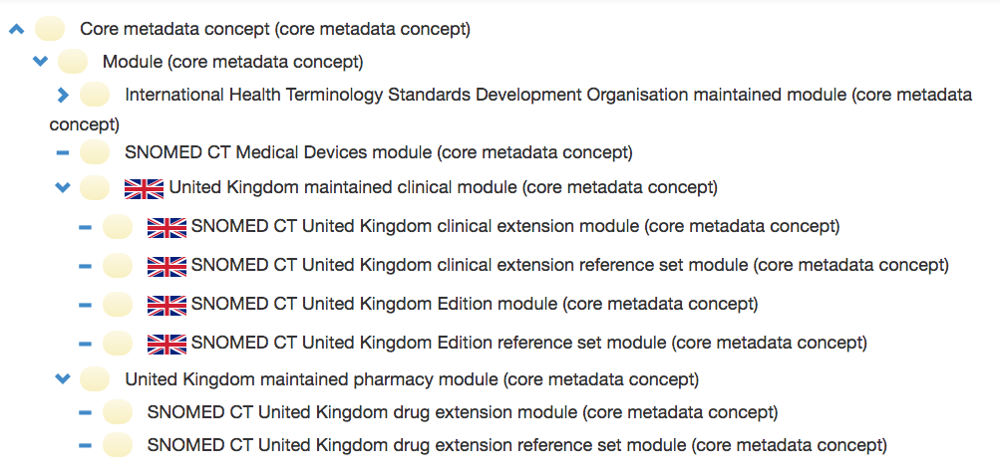

# Extensions

## Extensions

A SNOMED CT extension is a set of components and reference set members that add to the SNOMED CT International Edition. An extension is created, structured, maintained and distributed in accordance with SNOMED CT specifications and guidelines. Unlike, the International Edition an extension is not a standalone terminology. The content in an extension depends on the SNOMED CT International Edition, and must be used together with the International Edition and any other extension module on which it depends.

## Modules in an Extension

As explained in modules, every extension must contain at least one module, and all content in an extension must belong to one of its extension modules. More than one module can be created within the same extension, if there is a business requirement to maintain or publish sets of components separately. The set of module concepts that are maintained by the same extension producer are grouped together in a single module subhierarchy. The figure below shows the module subhierarchy for the UK's National Release Center from the 20170401 UK Edition.

<figure><figcaption>
Module hierarchy from 20170401 UK Edition
</figcaption></figure>

Please note that some module concepts in the subhierarchy (e.g. | United Kingdom maintained clinical module (core metadata concept)| )serve as grouper concepts, which are never actually used as the moduleId of any content. The use of separate modules in the UK extension allow them to maintain and publish separate editions that include different content (e.g. with and without the drug extension). Using separate modules also allows module-based filters to be applied when searching content for a specific use case.

## Extension Versions

A specific version of an extension can be referred to using the date on which the extension was published. Versioned extension modules can be identified using the SNOMED CT URI standard format: http://snomed.info/module/{sctid}/time/{timestamp}. For more information, please refer to 2.4 [URIs for Modules](/broken/spaces/kgrE9Yh9vMDqL5ThuXjH/pages/RAGpqVOagq7gVB9TrGxI) and [Versioned Editions.](../../4%20logical-design/4.4%20editions)

<a href="https://docs.google.com/forms/d/e/1FAIpQLScTmbZIf0UEQwYDkY27EEWBkaiYkHSbR0_9DmFrMLXoQLyL7Q/viewform?usp=pp_url&#x26;entry.1767247133=Extension+Guide&#x26;entry.670899847=Extensions" class="button primary">Provide Feedback</a>
