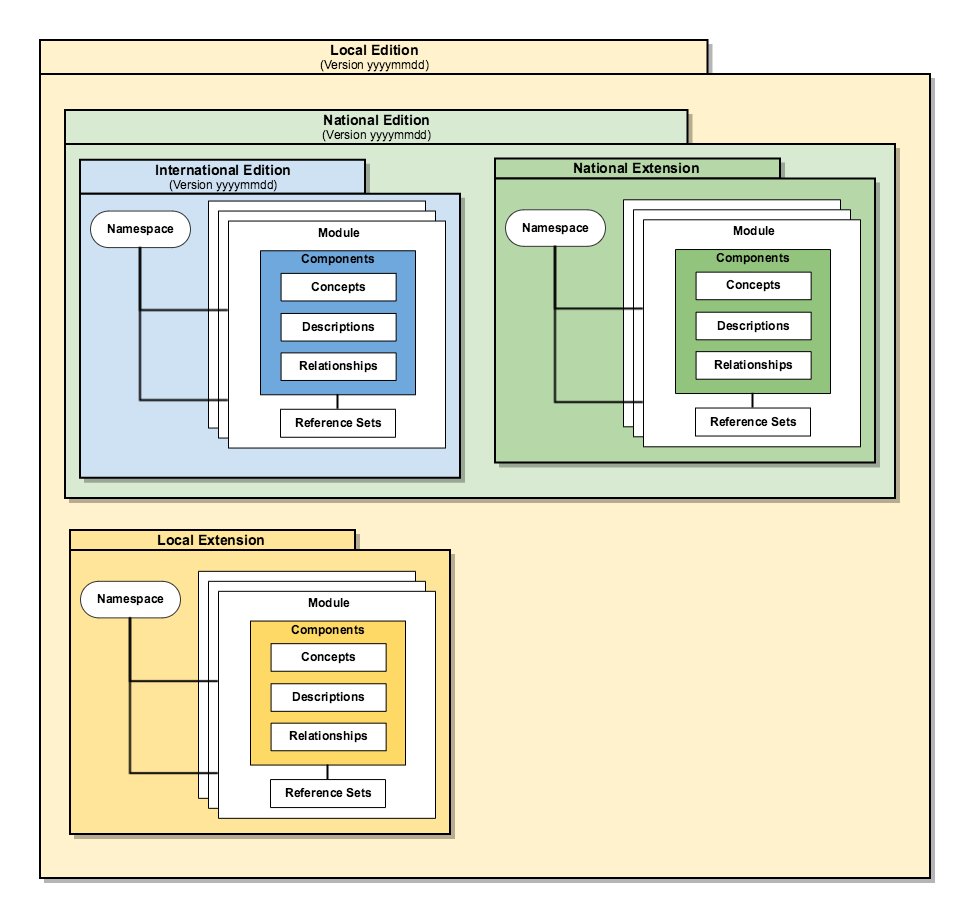

# 4 Logical Design

The logical design of a [SNOMED CT extension](https://confluence.ihtsdotools.org/display/DOCGLOSS/SNOMED+CT+Extension) is technically consistent with that of the [International Edition](https://confluence.ihtsdotools.org/display/DOCGLOSS/International+Edition "Glossary link: International Edition"). Both represent and version SNOMED CT components and reference sets in release files that conform to the [Release Format 2](https://confluence.ihtsdotools.org/display/DOCGLOSS/Release+Format+2 "Glossary link: Release Format 2") specification. This makes it easier for consumers of the [International Edition](https://confluence.ihtsdotools.org/display/DOCGLOSS/International+Edition "Glossary link: International Edition") to implement extensions. [Figure 4-1](https://confluence.ihtsdotools.org/display/DOCEXTPG/4+Logical+Design#Figure-editions-and-extensions "Logical design of a SNOMED CT local edition") illustrates the logical design of a typical SNOMED CT local edition and its relationship to the associated local extension, [National Edition](https://confluence.ihtsdotools.org/display/DOCGLOSS/National+Edition) and [International Edition](https://confluence.ihtsdotools.org/display/DOCGLOSS/International+Edition "Glossary link: International Edition").

<figure><figcaption>
Figure 4-1: Logical design of a SNOMED CT local edition
</figcaption></figure>

Every [SNOMED CT extension](https://confluence.ihtsdotools.org/display/DOCGLOSS/SNOMED+CT+Extension) includes one or more [modules](https://confluence.ihtsdotools.org/display/DOCGLOSS/Module), and each [module](https://confluence.ihtsdotools.org/display/DOCGLOSS/Module) contains either [SNOMED CT components](https://confluence.ihtsdotools.org/display/DOCGLOSS/SNOMED+CT+Component) or [reference sets](https://confluence.ihtsdotools.org/display/DOCGLOSS/Reference+set) (or both). Modules may be dependent on other modules. A national or local [extension](https://confluence.ihtsdotools.org/display/DOCGLOSS/Extension "Glossary link: Extension") uses a [namespace identifier](https://confluence.ihtsdotools.org/display/DOCGLOSS/Namespace+identifier) issued by SNOMED International to ensure that all extension components can be uniquely identified (across all [extensions](https://confluence.ihtsdotools.org/display/DOCGLOSS/Extension)). A SNOMED CT edition includes the contents of a focus module together with the contents of all the modules on which it depends. This includes the modules in the [International Edition](https://confluence.ihtsdotools.org/display/DOCGLOSS/International+Edition) and possibly other modules from a national and/or local extension. 

The following subsections explain this logical design in more detail:

  * [4.1 Namespaces](4.1-Namespaces_57815024.html)
  * [4.2 Modules](4.2-Modules_57815037.html)
  * [4.3 Extensions](4.3-Extensions_57815069.html)
  * [4.4 Editions](4.4-Editions_57815135.html)
  * [4.5 Release Packages](4.5-Release-Packages_57815193.html)

