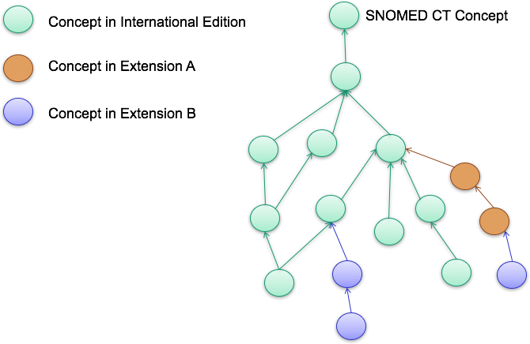
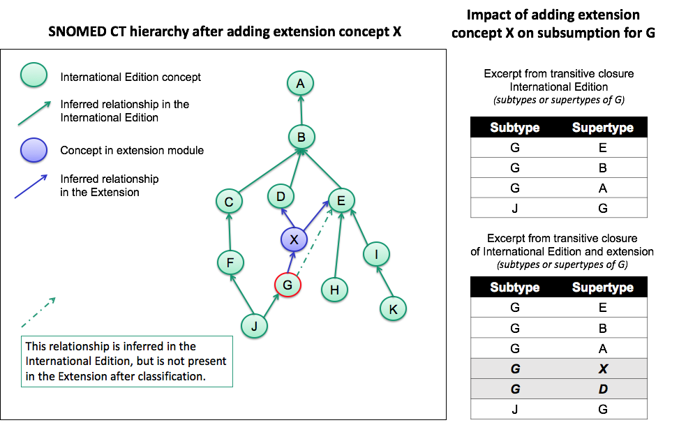

# 5.4.2.1 Add Concept in an Extension

# Purpose 

Concepts may be added to an extension to provide new clinical ideas which are not represented in the International Edition. The primary reason for adding concepts to an extension is to represent meanings which are outside the scope of the International Edition, yet within the scope of SNOMED CT. These might be concepts which have local relevance, within a single country, territory or organization. Concepts may also be added to an extension to represent metadata about the extension, for example [module](4 Logical Design/4.2-.2.md) concepts, reference set concepts, or new attributes.

For a more detailed introduction on the purposes for adding concepts to an extension, please refer to Section [3 Purpose](3 Purpose/README.md).

# Principles

## Overview

Key principles for authoring concepts in an extension include

  * Concepts added to an extension must have a _moduleId_ that includes the namespace identifier assigned to that extension producer by SNOMED International
  * An extension concept must comply with the logical design of SNOMED CT components and maintain referential integrity
  * Concepts added to an extension should conform to the policies stated in [5.3.2 Constraints on Concept Requests](5 Key Steps/5.3.2-.2.md)
  * Use caution when authoring an intermediate concept in an extension, i.e. a concept which is a supertype of a concept in the International Edition

## Essential Descriptions and Relationships

A concept created in an extension must conform to the logical design of SNOMED CT concepts. An overview of the logical model is provided in [Figure 5.4.2.1-1](https://confluence.ihtsdotools.org/display/DOCEXTPG/5.4.2.1+Add+Concept+in+an+Extension#Figure-logical-model-overview "Logical Model Overview"). This means that every concept created in an extension must have:

  * At least one [ | Is a|](http://snomed.info/id/116680003 "116680003 | Is a |") relationship
  * At least one description of type [ | Fully specified name|](http://snomed.info/id/900000000000003001 "900000000000003001 | Fully specified name |")
  * At least one description of type [ | Synonym|](http://snomed.info/id/900000000000013009 "900000000000013009 | Synonym |")

## Additional Descriptions and Relationships

Concepts created in an extension may also have additional descriptions and defining relationships.

Additional defining relationships may include [ | Is a|](http://snomed.info/id/116680003 "116680003 | Is a |") relationships and attribute relationships. When specifying attribute relations for an extension concept it is important to ensure compliance with the SNOMED CT concept model. The concept model specifies the attributes that can be applied to particular types of concepts and it specifies the permitted values for each of these attributes. There are also additional rules on the cardinality and grouping of particular types of relationships. Please see the [SNOMED CT Editorial Guide](https://confluence.ihtsdotools.org/display/DOCEG/SNOMED+CT+Editorial+Guide) and the [SNOMED CT Machine Readable Concept Model](https://confluence.ihtsdotools.org/display/DOCMRCM/SNOMED+CT+Machine+Readable+Concept+Model) for details on the concept model rules. 

  

Figure 5.4.2.1-1: Logical Model Overview

## Retaining Referential Integrity

As discussed in [module dependencies](4 Logical Design/4.2.2-.2.md), all extensions have modules which depend on the modules in the International Edition. Extensions may also have modules which depend on the modules from other extensions. Despite the dependencies between modules from various editions, all concepts in an extension must be a subtype of the root concept, [ 138875005 | SNOMED CT Concept|](http://snomed.info/id/138875005 "138875005 | SNOMED CT Concept |") . This ensures that a concept in an extension can be queried and retrieved in a similar way to any concept in the International Edition. Put another way, queries which use subsumption should be able to identify a concept which belongs to a module in an extension because it is a subtype of a concept from the International Edition.

Extension concepts must be a subtype of the SNOMED CT root concept  

| The diagram illustrates how all concepts from Extension B are related to concepts in the International Edition. This is because the concept is either a direct child of a concept in the International Edition or because it is subsumed by concepts in the International Edition through subtype relationships defined by concepts in Extension A.  
  
The referential integrity of a concept in an extension is retained by the addition of at least one [ | is a|](http://snomed.info/id/116680003 "116680003 | is a |") relationship to a parent concept that is subsumed by [ | SNOMED CT Concept|](http://snomed.info/id/138875005 "138875005 | SNOMED CT Concept |") . The parent may be a concept which is part of a module within the extension, another extension, or the International Edition. 

## Leaf and Intermediate Extension Concepts

When an extension producer creates a new concept and states one or more [ | is a|](http://snomed.info/id/116680003 "116680003 | is a |") relationships to define that concept the immediate effect is to make the new concept a _leaf concept_ in the SNOMED CT subtype hierarchy. That is to say the new concept at this point has no known subtypes. 

There are several situations in which this new concept may acquire new subtypes:

  1. Other concepts in the same extension module may be stated to be a subtypes of the new concept 
  2. The organization responsible for another module that depends on this extension module may, in the future, state that some concepts in their module are subtypes of this new concept 
  3. When a [Description logic classifier](https://confluence.ihtsdotools.org/display/DOCGLOSS/Description+logic+classifier "Glossary link: Description logic classifier") is applied to the contents of the module (and the set of modules it depends upon), the defining relationships associated with a new fully defined concept may lead to additional subtype relationships being inferred. These inferred subtypes may be concepts in the extension module itself or in any module on which the extension module depends (including International Edition modules).
  4. It is also possible (although caution is advised) that the creator of the new concept might state that the concept is a supertype of a concept in the International Edition or in another module on which the extension module depends .
  5. it is also possible (although caution is advised) that an extension producer might add a defining relationship to a concept in the International Edition (or in another module on which the extension module depends), and this new defining relationship may lead to a variety of new relationships (including subtype relationships) being inferred by a [Description logic classifier](https://confluence.ihtsdotools.org/display/DOCGLOSS/Description+logic+classifier "Glossary link: Description logic classifier").

Situations 1 and 2 above both result in the subtypes of the new concept either belong to the extension module or a module that depends on the extension module. This does not create any exceptions.

In contrast, situations 3 and 4 can result in the new concept becoming an  _intermediate concept_ that sits between two concepts from the International Edition (or from another module on which the extension module depends). This means that the new concept is inferred to be a supertype of a concept from the International Edition (or another module that the extension module depends on). Since, all extension concepts are a subtype of a concept from the International Edition, the new concept represents an intermediate node in the inferred hierarchy between two International Edition concepts. This _intermediate concept_ is only present in the editions that include the extension, so it does not directly alter the International Edition. However, it does create a situation in which the inferred view of the International Edition hierarchy seen by those using the extension differs from the view seen by other users of the International Edition.

Situation 3 does not impact the logical definition of the inferred subtypes in the International Edition since concepts will only be inferred as subtypes if they already share the logical definition of a fully-defined supertype. However, if (as in situation 4) an International Edition concept is stated to be a subtype of the new extension concept, the impact can be more profound. In this case, the logical inference is that all defining attribute relationships of the new concept must also apply to the subtype concepts. Finally, situation 5 directly changes the logical definition of a concept from a module published by another organization. This can have a profound effect not only on that concept itself, but also on subtypes of that concept and on the inferred subtype hierarchy of the International Edition as seen by users of the extension.

In summary, extension producers should try to avoid the authoring scenarios described in situations 3, 4, and 5 above. Doing so will prevent unexpected or undesirable behaviour, which can be directly attributed to modifying the definitions of International concepts. These situations are, however, permitted if they are necessary to meet legitimate clinical needs or to correct identified clinical issues.

A good way to assess the impact of a change is to compare the [transitive closure](https://confluence.ihtsdotools.org/display/DOCGLOSS/transitive+closure "Glossary link: transitive closure") of subtype ( [ | is a|](http://snomed.info/id/116680003 "116680003 | is a |") ) relationships after classifying the terminology with and without the extension. As a general rule, the transitive closure of the International Edition should not be modified by classifying it together with an extension. 

### Examples

The following 3 examples illustrate the impact of adding extension concepts as leaf concepts or intermediate concepts (after classification). The impact is considered in terms of how each addition effects subsumption testing using an example international concept 'G'. 

Table 5.4.2.1-1: Example 1 - Primitive Extension Concept as a Leaf Concept

Illustration| |---  
Impact on hierarchy| A primitive extension concept, which is created as a leaf concept, must always be a subtype of an international edition concept, and will not be classified as a supertype of an international concept.   
Impact on subsumption| The addition of this type of content does not impact subsumption testing of concepts in the international edition, because it will remain distal in the hierarchy to all International content after classification.   
In this case, the transitive closure of the International Edition will stay the same, except for the addition of the new inferred [ | is a|](http://snomed.info/id/116680003 "116680003 | is a |") relationship associated with the concept from the extension.  
  
Table 5.4.2.1-2: Example 2 - Extension Concept as an Intermediate Concept (No impact on subsumption)

Illustration| |---  
Impact on hierarchy| The definition of a concept in an extension module may result in it being classified as an intermediate concept in the SNOMED CT polyhierarchy, as illustrated in the diagram above.This scenario results in the creation of two new inferred [ | is a|](http://snomed.info/id/116680003 "116680003 | is a |") relationships in the extension, i.e. the relationships **G | is a | X** and **X | is a | E**. The inferred relationship **G | is a | E**(green dotted line), which is present in the international edition, becomes redundant when classified together with the extension (therefore marked grey in the diagram).  
Impact on subsumption| This type of intermediate extension concept does not change the results of subsumption testing between international concepts. It does, however, have an impact on which relationships from the international edition are non-redundant in the extension edition. In this example, the inferred relationship **G |is a| E** becomes redundant when combined with the inferred relationships from the extension.Extension producers can handle this redundancy by:

  * Inactivating the inferred relationship from the International Edition, i.e. inactivate the relationship **G | is a | E**. For more information, see [5.4.4.3 Inactivate Relationship in an Extension](5 Key Steps/5.4.4.3-.3.md).

  
  
Table 5.4.2.1-3: Example 3 - Extension Concept as an Intermediate Concept (Impact on subsumption)

Illustration| |---  
Impact on hierarchy| The definition of a concept in an extension module may result in it being classified as an intermediate concept in the SNOMED CT polyhierarchy, as illustrated in the diagram above.This scenario results in the creation of three new inferred  [ | is a|](http://snomed.info/id/116680003 "116680003 | is a |") relationships in the extension, i.e. the relationships **G | is a | X** and **X | is a | D and****X | is a | E**. The inferred relationship**G | is a | E**(green dotted line), which is present in the international edition, becomes redundant when combined with the inferred relationships from the extension. Furthermore, the definition of the extension concept **X** results in a modification of the definition of the international concept **G** , as **G** is now a subtype of the international concept **D.**  
Impact on subsumption| This type of intermediate extension concept may change the results of subsumption testing for particular international concepts, when used within the local edition. Extension producers should therefore exercise extreme caution when introducing this type of concept addition.When using the International Edition on its own, the concept **G** will **not** be treated as a subtype of the concept **D**. However, users of this example extension edition will see the international concept **G** as a subtype of the international concept **D**. This means that queries over international concepts stored in clinical data will lead to different results, depending on which edition is used. Therefore, intermediate concepts of this type may have serious consequences on the comparability and interoperability across SNOEMD CT Editions.  
  
# Process

Concepts added to an extension are represented in a concept file. These concepts are part of a module which includes the namespace identifier assigned to the extension producer by SNOMED International. Each concept also requires additional components and reference set members to be defined. At a minimum, the following components and derivatives should be created:

  * The concept component, which represents the actual clinical meaning required in the extension
  * At least one description component of type [ | Fully specified name|](http://snomed.info/id/900000000000003001 "900000000000003001 | Fully specified name |")
  * At least one description component of type [ | Synonym|](http://snomed.info/id/900000000000013009 "900000000000013009 | Synonym |")
  * At least one relationship of type [ | is a|](http://snomed.info/id/116680003 "116680003 | is a |") , which ensures that the concept is a descendant of [ | SNOMED CT Concept|](http://snomed.info/id/138875005 "138875005 | SNOMED CT Concept |")
  * A language reference set row for each new description to specify the acceptability of the description within the relevant language or dialect

The table below provides a summary of the process to follow when adding a new concept to an extension. 

File Type| Process  
---|---  
**Concept**|  A new concept identifier is allocated within the extension namespace.  
The attributes of the new concept are set as follows:

  * _id_ is set to the new concept identifier allocated within the extension namespace
  *  _effectiveTime_ is set to the date the extension will be published
  *  _active_ is set to 1 to indicate that the new concept will be active at the time of publication
  *  _moduleId_ is set to the conceptId of a module that is managed by the extension producer
  *  _definitionStatusId_ is set to state whether the concept is primitive or fully defined

  
**Stated Axiom**  
**  
**| Authoring the concept definition involves specifying the defining properties of the concept, i.e. stating the axioms that represent necessary conditions for the meaning of the concept. For more information, see[SNOMED CT Logic Profile Specification](https://confluence.ihtsdotools.org/display/DOCLPS) and [SNOMED CT OWL Guide](https://confluence.ihtsdotools.org/display/DOCOWL/SNOMED+CT+OWL+Guide?src=sidebar "SNOMED CT OWL Guide").  
To prepare for publication, a new row representing the concept definition is added to the [OWL axiom reference set](https://confluence.ihtsdotools.org/display/DOCRELFMT/5.2.1.9+OWL+Expression+Reference+Set).  
The attributes of the reference set member representing the stated axiom are set as follows:

  * _id_ is set to the new relationship identifier allocated within the extension namespace.
  * _effectiveTime_ is set to the date the extension will be published
  *  _active_ is set to '1' to indicate that the new relationship will be active at the time of publication
  *  _moduleId_ is set to identify a module concept from the extension
  *  _referencedComponentId_ is set to the identifier generated for the new concept 
  *  _owlExpression_ is set to the text of the OWL expression representing the defining properties of the new concept

  
**Description**|  A description of type of [ | Fully specified name|](http://snomed.info/id/900000000000003001 "900000000000003001 | Fully specified name |") and at least one description of type of [ | Synonym|](http://snomed.info/id/900000000000013009 "900000000000013009 | Synonym |") is added.For more information on creating descriptions, please refer to [5.4.3.1 Add Description in an Extension](5 Key Steps/5.4.3.1-.1.md)  
**Language reference set**|  The new descriptions of the concept are referenced in at least one language refset to indicate language preferences.
