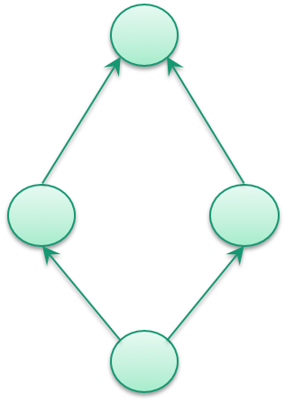

# 5.4.4.1 Add Relationship in an Extension

# Purpose

Relationships may be added in an extension for various reasons including:

  * Specifying the defining characteristics of new extension concepts
  * Improving the definition of an existing extension concept
  * In exceptional cases, it may be permissible to add defining relationships to
    * Concepts which belong to the International Edition
    * Concepts which belong to another module on which the extension depends

# Principles

## Overview

A SNOMED CT relationship involves three main concepts - the source concept, the destination concept, and the relationship type concept (also known as the 'attribute'). Each of the concepts in an extension relationship may belong to either a module from the extension itself, or a module upon which the extension depends (e.g. an international module).

When adding new relationships in an extension, the following principles apply:

  * **Source Concept** : Except in exceptional cases (noted below), the relationship must represent a defining characteristic of a concept in a module for which the extension producer is responsible.
    * This means that the sourceId of the relationship should refer to a concept in the extension.

  * **Attribute** : The type of relationship should usually be represented by an attribute concept which is part of the SNOMED International Edition.
    * When using an attribute from the International Edition, concept model rules and editorial guidance should be followed. For example, relationships should comply with the rules stated in the [MRCM](http://snomed.org/mrcm).
    * In some cases, new attribute concepts may be added to an extension. While this is permitted, new attributes should be applied with caution, and concept model rules and editorial guidance should be clearly documented by the extension provider. 

  * **Destination Concept** : The target of the relationship may belong to the extension module, or any module on which the extension module depends (including an international module). However, care should be taken to avoid intermediate concepts as described in [5.4.2.1 Add Concept in an Extension](5 Key Steps/5.4.2.1-.1.md)). Additionally, it is important to ensure that the added relationships do not induce any cycles, i.e. it should be ensured that the added relationships retain the SNOMED CT hierarchy as a Directed Acyclic Graph. 

**Cyclic Graph**| **Directed Acyclic Graph**  
---|---  
NOT ALLOWED| ALLOWED  
  
# Process

The table below provides a summary of the process to follow when adding a new relationship to an extension.

File Type| Process  
---|---  
**Stated Axiom**|  A prerequisite for generating the relationships in the relationship file is that concepts have been authored and the defining properties stated and classified together with the SNOMED CT content it belongs to. Please see [5.4.2.1 Add Concept in an Extension](https://confluence.ihtsdotools.org/display/WIPEXTPG/5.4.2.1+Add+Concept+in+an+Extension?src=sidebar).  
**Relationship**|  Once authoring is complete, the contents of the extension modules, together with every module on which these depend, are classified.The resulting set of inferred relationships (i.e. the output of the classification process) is added to the Relationship file.  
A new row is added to the Relationship file for every inferred relationship that results from the classification process.  
The attributes of the inferred relationships are set as follows:

  * _id_ is set to a new relationship identifier allocated within the extension namespace.
  * _effectiveTime_ is set to the date the extension will be published
  *  _active_ is set to '1' to indicate that the new relationship will be active at the time of publication
  *  _moduleId_ is set to identify a module concept from the extension
  *  _sourceId_ is set to the source concept in the relationship. This will usually belong to the extension module.
  * _destinationId_ is set to the destination concept in the relationship
  *  _relationshipGroup_ is set to a number that indicates which relationships with the same sourceId are logically grouped together
  *  _typeId_ is set to an attribute concept that represents the type of the relationship
  *  _characteristicTypeId_ is usually set to [900000000000011006 |Inferred relationship|](http://snomed.info/id/900000000000011006)
  * _modifierId_ is usually set to [900000000000451002 |Existential restriction modifier|](http://snomed.info/id/900000000000451002)

  
  
  

