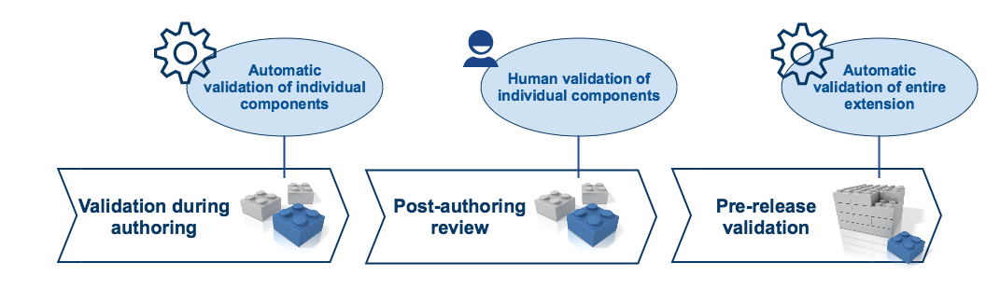

# 5.5 Review and Validation

Validating the content in an extension is the process of ensuring that all components and reference sets within the extension comply with the authoring principles. As illustrated in [Figure 5.5-1](https://confluence.ihtsdotools.org/display/DOCEXTPG/5.5+Review+and+Validation#Figure-extension-validation-involves-both-automated-and-manual-processes "Extension validation involves both automated and manual processes"), this process involves three main steps: Validation during authoring, post-authoring review, and pre-release validation.

Figure 5.5-1: Extension validation involves both automated and manual processes

Effective and high quality terminology authoring processes should include thorough automated validation. This is required to ensure that all terminology components added, updated or inactivated in the extension comply with all automatically verifiable authoring principles, including concept model rules, the SNOMED CT logical design and referential integrity constraints. After the authoring process, it is important to also perform a human review of all authored content to ensure that relevant editorial guidelines and principles are followed (including those which may not be able to be automatically checked), and that the updated content is acceptable from an author and user perspective. Finally, automated validation is required before the extension is released to ensure the correctness and consistency of the release as a whole.

The following pages explain each of these key validation steps further.

  * [5.5.1 Validation During Authoring](5 Key Steps/5.5.1-.1.md)
  * [5.5.2 Post Authoring Review](5 Key Steps/5.5.2-.2.md)
  * [5.5.3 Pre-release Validation](5 Key Steps/5.5.3-.3.md)

