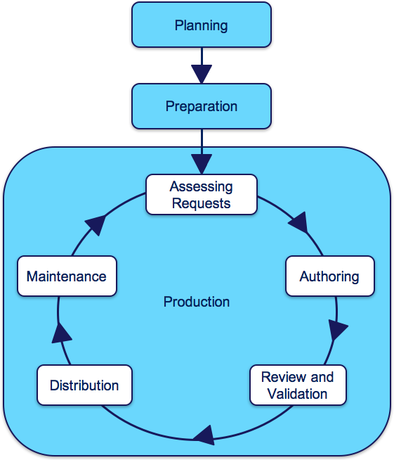

# 5 Key Steps

While the lifecycle of each extension will vary due to differences in requirements and scope, three main phases can typically be identified -  _Planning_ ,  _Preparation_ and  _Production_.

  1. The _planning phase_ ensures that the requirements can be met by the extension design, resources and processes used. 
  2. The  _preparation_ phase ensures that the technical prerequisites are in place, including the namespace, module(s), module dependencies and appropriate tooling.
  3. The  _production phase_ involves the development, distribution and maintenance of the extension.

The production phase can be further divided into several key steps, including Assessing  _Requests,_  _Authoring_ ,  _Review_ ,  _Distribution_ , and  _Maintenance_.

  1. _Assessing Requests_ \- Requests for new terminology products or content changes are submitted and processed to determine whether or not they will be accepted into the extension, submitted to a National Edition, submitted to the International Edition, or rejected.
  2. _Authoring_ \- SNOMED CT components and reference set members are added, modified or inactivated according to the SNOMED CT editorial principles and policies. It should be noted that:  

     * It is the responsibility of the extension producer to ensure that the quality and integrity of the extension is maintained, and that all content changes are made in a module that is owned by the  _terminology producer_ themselves.
     * All changes made to SNOMED CT components or reference set members should be represented as new versions and assigned to a module owned by the  _terminology producer_. No changes are permitted to content of the International Release. Any modifications resulting in changes to the classification of international content must be accompanied by a disclaimer notifying users of the differences between the extension edition and the International Edition. 
     * Any substantive improvements or corrections to the content in the International Edition that is made in an extension should be submitted to SNOMED International in a timely fashion to improve the quality of the International Edition for all users.
  3. _Review_  _and Validation_ \- SNOMED CT extension content should be validated using automated tests both at the time of authoring and before a release is packaged for distribution. In addition, manual review of the terminology content is also vital to ensure that it meets the quality standards for usability and clinical safety which cannot be tested automatically.
  4. _Distribution_ \- This involves classifying the extension content[1](https://confluence.ihtsdotools.org/display/DOCEXTPG/5+Key+Steps#Footnote1 "Footnote: Click here to display the footnote") , packaging the release files, validating the distribution package, and making the release package available to _terminology consumers_.

  5. _Maintenance_ \- A SNOMED CT extension must be maintained to respond to new change requests, and to ensure that the consistency and integrity with the International Edition (and other modules on which it depends) is maintained appropriately.

These key phases and steps in the lifecycle of an extension are illustrated below in [Figure 5-1](https://confluence.ihtsdotools.org/display/DOCEXTPG/5+Key+Steps#Figure-extension-lifecycle-overview "Extension Lifecycle Overview"). Further details about each of these key phases and steps are provided in the subsequent sections, together with the principles that should be followed to ensure the quality and integrity of a SNOMED CT extension.

Figure 5-1: Extension Lifecycle Overview

Footnotes Ref | Notes  
---|---  
[1](https://confluence.ihtsdotools.org/display/DOCEXTPG/5+Key+Steps#FootnoteMarker1-0 "Footnote: Click to return to reference in text") |  In practice, classification of an extension module requires it to be combined with the all the modules on which it depends, including the International Edition modules. 
