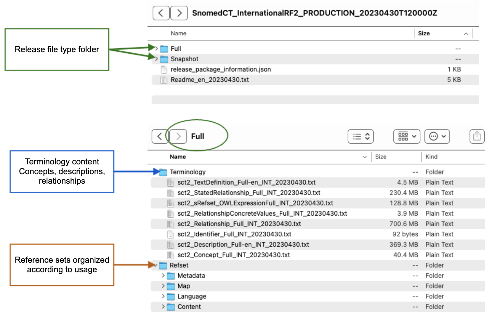

# Packaging and File Naming

## Purpose

The purpose of the SNOMED CT packaging process is to assemble a set of SNOMED CT files into an archive of a specified structure to support easy adoption by terminology consumers. The resulting archive is a distributable package for the specific extension or edition. A SNOMED CT package uses a standard naming convention and its contents are structured in a standard format. The packaging process may begin when all the files that comprise a specific SNOMED CT extension or edition have been created, populated and validated.

Additional Packaging Notes:

1. Each SNOMED CT release package may logically consist of one or more editions, with each edition consisting of the set of components and reference set members which belong to a focus module, plus the contents of the modules on which the focus module depends.
2. The module dependencies used to define the contents of an edition are represented using a [Module Dependency Reference Set](<../../../4 logical-design/4.3 extensions/4.3.2 reference-sets/4.3.2.4 essential-reference-sets/4.3.2.4.2-module-dependency-reference-set.md>).
3. SNOMED CT editions can be identified using a URI that is formatted according to the [SNOMED CT URI Standard](https://app.gitbook.com/o/h8Z6qGxuQrzM9vbx5bPT/s/kgrE9Yh9vMDqL5ThuXjH/). (For more specific information please refer to [URIs for Editions and Versions](https://app.gitbook.com/s/kgrE9Yh9vMDqL5ThuXjH/2-snomed-ct-uri-space/2.1-uris-for-editions-and-versions).)

## Release File Packaging 

SNOMED CT content in the International Edition is organized into two top level folders according to the release file types - Full and Snapshot. When packaging extensions and editions, this should be done using the same folder structure. Note that extension producers are only required to include the full release type for the extension. The snapshot release is optional, because it can be calculated from the full release. However, distribution of both release file types is recommended to simplify use by terminology consumers.

Each release file type has the same nested folder structure, with the following two subfolders:

* **Terminology** folder, which contains the concepts, descriptions and relationships files
* **Refset** folder, which contains a range of reference set files ordered into subfolders according to their usage

The following recommendations apply to the structure and format of SNOMED CT release packages:

1. It is recommended that documentation should be removed from the release packages, and hosted separately.  This allows for ongoing updates, if required.
   1. Note that some exceptions may apply, such as the readme.txt file
2. The main component files (e.g. Concept, Description, Relationship) are nested under the Terminology folder
3. All reference sets files are nested under the Refset folder, in the relevant subfolder:
   1. **Content** folder contains reference sets that represent SNOMED CT subsets
   2. **Language** folder contains a language reference set, for each applicable language or dialect
   3. **Map** folder contains simple, complex and extended map reference sets
   4. **Metadata** folder contains supporting metadata files, including the reference set descriptor reference set, the module dependency reference set, and the machine readable concept model (MRCM) reference sets

The recommended folder structure is illustrated below.

<table><thead><tr><th width="182.9296875" valign="top">General Release Folder Structure</th><th valign="top">Example - International Release</th></tr></thead><tbody><tr><td valign="top">

<strong>Full</strong>
<ul><li>Terminology</li><li>Refset</li><li>

<ul><li>Content</li><li>Language</li><li>Map</li><li>Metadata </li></ul></li></ul>
<strong>Snapshot</strong>
<ul><li>Terminology</li><li>Refset</li><li>

<ul><li>Content</li><li>Language</li><li>Map</li><li>Metadata</li></ul></li></ul></td><td valign="top">
<figure><figcaption></figcaption></figure>
</td></tr></tbody></table>

SNOMED International provides templates to support extension producers in proper packaging of the release files. These templates detail the minimum expected set of files for each release product, plus the folder structure in which they should be packaged. For more information and to download these templates, please refer to [https://confluence.ihtsdotools.org/display/RMT/Release+Package+Templates](https://confluence.ihtsdotools.org/display/RMT/Release+Package+Templates)

## Packaging Options 

Two main approaches to packaging exist:

* **Extension:** Packaging the extension modules separately from the modules in other editions or extensions
* **Edition:** Packaging the extension modules together with the modules from the International Release (and other modules on which the extension depends), as a single package with the terminology content available in combined release files

The approach that is best for a given situation will depend on the content of the extension and the requirements of the consumers of the extension. The following subsections discuss each approach.

### Packaging as an Extension 

The figure  below illustrates the idea of packaging as an extension. In this approach, the extension content is released in a separate package, which is not intended to be used on its own. Instead, the contents of the extension package must be combined with other packages (including the international release) by the terminology consumer. To determine which packages must be combined, the module dependency reference set is used to identify the dependencies for a given SNOMED CT edition (based on its focus module).

In the example below, the national content and local content have each been packaged as extensions. A terminology consumer must therefore combine the Local Extension package, the National Extension package and the International Edition package to achieve a complete terminology solution. Note that each package uses the same folder structure.

<figure><figcaption>
Creating a SNOMED CT Edition from extension packages
</figcaption></figure>

Extension producers choosing this packaging approach may package the content of the extension into release files in a variety of ways, including:

* All content for a particular type of component (e.g. Concept) that is maintained by the extension producer is released in a single file. Components in this file may have different moduleIds, where the content has been authored in separate modules. Please note that where descriptions are authored in more than one language, these are generally included in separate files, with the applicable language code included in the file name.
* All content for a particular type of component (e.g. of type Concept) is included in a set of files, with each file using a single moduleId.

Extension packaging may be appropriate when the content has the following characteristics:

* The extension is used only to distribute a translated version of the terminology&#x20;
* The extension is used only to distribute reference sets and the associated metadata, and does not involve the addition of clinical concepts
* The modules in the extension are intended to be reused by multiple editions, which will each be classified with a different combined set of modules

### Packaging as an Edition 

The figure below illustrates the idea of packaging as an edition. In this approach, the package can be used on its own, without the need to combine with other packages.

When packaging an extension as an edition, the extension content is combined with the International Edition (and any other module on which the extension depends), in the standard folder structure. All content of a particular type is included in a single file, irrespective of the module it belongs to or the organization responsible for maintaining it. Care should be taken not to modify, add to or remove content that belongs to a module maintained by another organization. For more information please refer to  [authoring extensions](<../../5.4 authoring/>).

<figure><figcaption>
Packaging an extension as an edition
</figcaption></figure>

Edition packaging may be appropriate when the content has the following characteristics:

* The extension includes new clinical concepts that need to be classified together with the International Edition (and other modules on which the extension depends). See [Classifying an Edition](5.6.1.1-classifying-an-edition.md) .

### File Naming 

Files in an extension should be named in accordance with the SNOMED CT file naming convention. The file naming convention can simplify implementation and provide the following benefits:

* A consistent naming convention across the International Edition and each National Edition
* Predictable file naming which provides a stable pattern for naming over time and between releases
* A standard way to identify the source and namespace by which a release file is managed
* A consistent versioning mechanism
* A mechanism to identify the contents of a file at a high level
* A mechanism to identify the type of information stored in a release file (e.g. documentation, tooling, etc.)
* Guidance on file naming for release files in non-English extensions
* Assurance that names will be unique across all editions and extensions over time

Quality assurance checks, which ensure that the naming convention has been applied, should be performed as part of the release process. For more information please refer to [Release File Naming Convention](https://app.gitbook.com/s/irKbJsZG57nSWZA4GT0M/5-reference-set-release-files-specification/5.2-reference-set-types/5.2.3-map-reference-sets/5.2.3.2-simple-map-to-snomed-ct-reference-set).

<a href="https://docs.google.com/forms/d/e/1FAIpQLScTmbZIf0UEQwYDkY27EEWBkaiYkHSbR0_9DmFrMLXoQLyL7Q/viewform?usp=pp_url&#x26;entry.1767247133=Extension+Guide&#x26;entry.670899847=5.6.1.2%20Packaging%20and%20File%20Naming" class="button primary">Provide Feedback</a>
