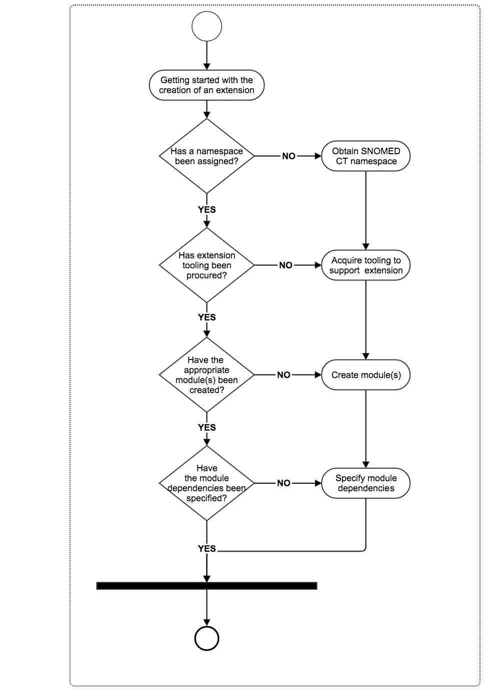

# 5.2 Preparation

Prior to creating the components or reference sets in an extension, some preliminary steps must be completed. These tasks include: 

  1. Obtaining a namespace identifier from SNOMED International 
     * A namespace identifier is required to generate component identifiers (SCTIDs)
  2. Acquiring the appropriate tools to support the creation, management, and distrbution of the extension 
     * Which tools, functionalities and services are required will depend on the content of the extension 
     * For more information please refer to [Tooling Requirements](5.2.1-Tooling-Requirements_57815385.html)
     * Note that these tools will be used to complete the steps listed below
  3. Creating module(s) 
     * At least one module concept is required
     * Components and reference sets which belong to the extension are assigned to the approriate module 
  4. Specifying module dependencies 
     * These dependencies are specified using the [Module Dependency Reference Set](4.3.2.4.2-Module-Dependency-Reference-Set_57815133.html)
     * This informs the consumers of the extension as to which additional modules are required to use/process the content of the extension 
       * Note that some of these modules will come from other editions (such as the International Edition) and possibly, other extensions 

[Figure 5.2-1](https://confluence.ihtsdotools.org/display/DOCEXTPG/5.2+Preparation#Figure-prerequisites-to-creating-an-extension "Prerequisites to creating an extension") illustrates these key steps during the initial stage of extension creation. 

Figure 5.2-1: Prerequisites to creating an extension
