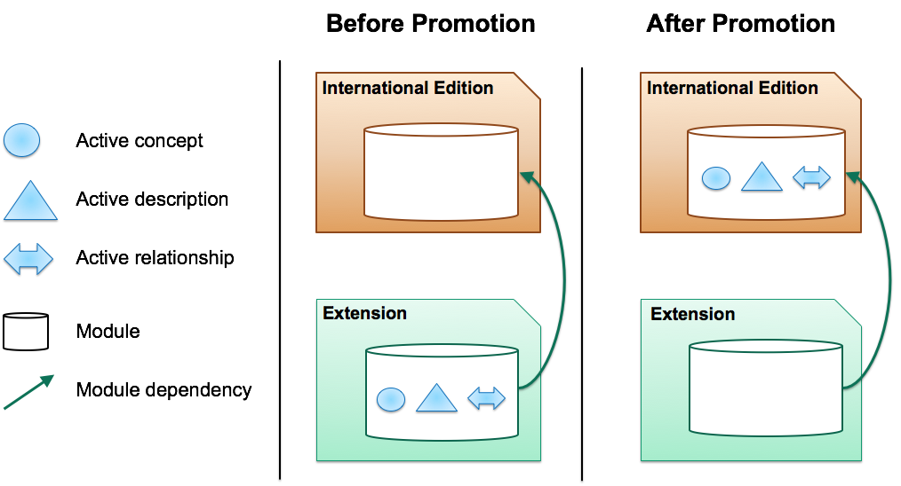

# 5.4.1.1 Promotion and Demotion

SNOMED CT content may sometimes need to be moved from one module to another, to enable it to be published in a different edition. Moving SNOMED CT content **up** the module dependency chain (i.e. from a given module to a module on which it depends) is known as  _content promotion_. This may be required to make the content accessible to a wider audience. Moving SNOMED CT content **down** the module dependency chain (i.e. from a given module to a module that is dependent on it) is known as  _content demotion_. This may be required to make the content accessible to a narrower audience. In these situations, it is essential to be aware of the principles for promotion and demotion. These principles ensure the integrity and traceability of the content, in both the original module and the module to which it is moved.

Content Promotion

SNOMED CT components may be promoted from an extension module into a less dependent module to enable broader use. For example, an extension concept may be promoted to the International Edition to enable SNOMED CT users to share the concept. Please note that a component may only be promoted to a module on which the extension module depends (as specified in the module dependency reference set).

When promoting components from an extension into the International Edition, the donating organization (i.e., the owner of the extension) should submit a promotion request to SNOMED International with the details of all components to be promoted. The SNOMED International authoring team process the request and consider whether the content is acceptable for inclusion in the International Edition.

Once promoted, a new version of the component is available in the International Edition with a new _EffectiveTime_ , an international  _moduleId_ , and the same SNOMED CT identifier as was used in the originating extension. From that point forward, SNOMED International becomes responsible for maintaining the promoted content. Future releases of the extension content alone, which are dependent on the new version of the International Edition (that contains the promoted content), will no longer include the promoted content in their Snapshot and Delta release files.[1](https://confluence.ihtsdotools.org/display/DOCEXTPG/5.4.1.1+Promotion+and+Demotion#Footnote1 "Footnote: Click here to display the footnote") The promoted content will, however, continue to appear in the Full release files of the extension Edition with an older EffectiveTime to reflect the ownership history of this content within the extension. Please note that the SNOMED CT identifiers of all promoted content will remain unchanged, and will therefore continue to include the namespace identifier of the originating organization.

Please note that it is essential that the promoted content is not inactivated in the extension from which it was promoted, as this would make it appear to users of the extension that the content is inactive. It is also important that the meaning of the content remains the same after it has been promoted, to ensure that the component identifiers permanently represent the same clinical meaning.

The diagram below illustrates how extension content is promoted to the SNOMED CT International Edition.

  

Figure 5.4.1.1-1: Promoting content to the International Edition

# Content Demotion

In some circumstances it may be necessary to demote SNOMED CT components. Demotion means moving a component from a given module to a module that is dependent on it. For example, moving a concept (and its associated descriptions and stated relationships) from the International Edition to a National Extension.

Content demotion is generally not recommended, because there are several risks associated with the management of demoted content. Once demoted, a different version of the component will be seen in different editions, and this redundancy needs to be managed carefully. Consideration should, therefore, be given when making the decision to demote a component.

If content demotion is deemed necessary, then it is very important to use a safe approach. As shown in the diagram below, the recommended approach for demoting SNOMED CT content is to inactivate the component in the source module and activate the component in the destination module at a more recent effective time.

Figure 5.4.1.1-2: Demoting content from the International Edition to extension

Updates should also be made to the respective component inactivation reference sets to indicate that the component has been inactivated. For more information on inactivation and historical associated reference sets, see [3.2.6.3. Managing Component Inactivation](https://confluence.ihtsdotools.org/display/DOCRFSPG/3.2.6.3.+Managing+Component+Inactivation). 

The following diagram shows the RF2 file changes that are required to demote an example concept from the international edition to an extension module. Please note that it is essential that the effectiveTime of the active component in the destination module is more recent than the effectiveTime of the inactive component in the source module. This is done to ensure that the demoted component is seen as active in any edition that uses the extension module to which it was demoted.

Figure 5.4.1.1-3: File changes required to demote a concept

Footnotes Ref | Notes  
---|---  
[1](https://confluence.ihtsdotools.org/display/DOCEXTPG/5.4.1.1+Promotion+and+Demotion#FootnoteMarker1-0 "Footnote: Click to return to reference in text") |  Please note that if the extension is published as part of an Edition, in which the files include content from both the extension and International Edition, then the Snapshot and Delta release files will contain the promoted content as part of the international module. 
